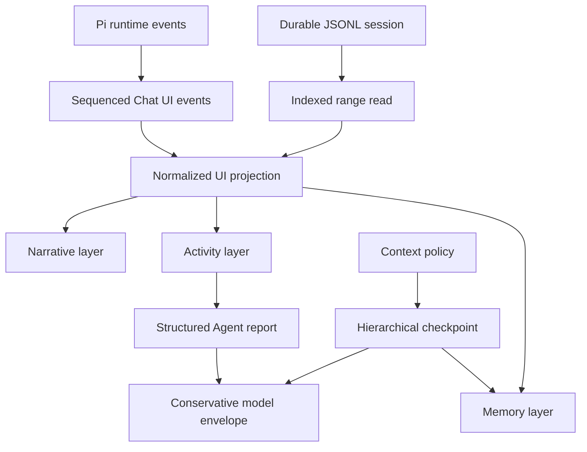

# Chat UI evolution

[Back to the developer handbook](README.md)

This document records the accepted direction after the first virtualized Chat UI performance pass. It is an architectural and product-design guide, not a release commitment. Concrete implementation work should still be split into measured, independently reviewable changes.

The implemented Narrative, Activity, and Memory layers are the current baseline. Performance work must not gradually introduce one-off cards, status colors, nested scroll containers beyond the bounded disclosure scrollport, or competing context indicators.

## Goals

- Keep transcript cost bounded as durable sessions grow.
- Let one text block, tool, or subagent card update without invalidating an entire message row.
- Preserve a complete UI execution trace while giving the parent model compact, structured results.
- Make delegated work and context compaction understandable without turning the transcript into a debugger console.
- Establish one visual language for narrative, active work, and memory boundaries.
- Measure performance in real Obsidian windows before claiming numerical improvements.

## Explicit non-goals

- Do not add transcript search as compensation for virtualization.
- Do not integrate provider-specific tokenizers. Context accounting may remain estimated and conservative.
- Do not enable TanStack Virtual `directDomUpdates` without a separate measured investigation.
- Do not migrate to React Virtuoso, Streamdown, assistant-ui, AI SDK, AG-UI, LangGraph, `remend`, or another Chat UI/Markdown framework.
- Do not replace Pi runtime, Obsidian Markdown fidelity, or the Pi-compatible JSONL session format.

## Evolution map



## Data and performance direction

### Indexed JSONL range reads

The session UI path now performs true recent-first hydration. Cold open reads indexed identity, summary, usage, UI context, and the latest 100 projected messages; reaching the top requests an older page by stable message ID. The Pi runtime continues to assemble complete model context from authoritative JSONL, so UI paging never truncates provider context.

Turn completion persists the produced assistant/tool sequence once, after the provider prompt resolves. A failed append is surfaced as a turn error instead of being logged while the UI appears successfully complete. On reopen, the indexed page joins each persisted `message_ui.turnRequest` to its user entry so current-note and attached-file badges, tool activity, and the final assistant response restore as one transcript turn.

Session writes use the [installed Pi dependency](../package.json)'s typed append methods after a single eager header bootstrap. Prior JSONL bytes therefore remain stable during normal message, Pivi metadata, UI context, and compaction appends. Full rewrites are reserved for non-append mutations such as redo truncation and upstream format migration; those operations are index-invalidation boundaries.

Each indexed session uses a rebuildable JSONL index in vault-scoped device-local storage under `~/.pivi/session-indexes/<vault-key>/` (legacy colocated `<session>.jsonl.pivi-index` sidecars migrate on read). It stores UTF-8 byte offsets, projection-relevant metadata such as `message_ui.targetEntryId`, and per-line SHA-256 values, plus append checkpoints containing file identity, modification time, size, bounded head/tail hashes, one-time migration state, and a checksum chain over every index line. Normal session appends extend both the authoritative JSONL and the device-local index; rewrite boundaries delete the index so the next indexed read rebuilds it atomically from the authoritative session JSONL. Read-only consumers discard a stale/corrupt optimization and rebuild before returning data. Every cached live mutation instead validates its held source fingerprint before touching Pi state, and append postflight requires the exact expected entry IDs; held-write mismatches remain typed failures and are never hidden by a post-write automatic rebuild. Filesystem change time is neither recorded nor compared because sync/provenance metadata updates can change it without changing JSONL bytes; size, device, inode, mtime, and bounded byte hashes remain the mutation guard.

The external-context privacy migration uses the sidecar's one-time marker. A completed marker skips session-body reads on startup and lazy open. A stale/corrupt pre-existing sidecar is discarded as an optimization before the authoritative JSONL is inspected. A legacy marker validates the held source after reading, writes device-local paths before rewriting JSONL, invalidates offsets before the rewrite, and rebuilds the marker from the sanitized authoritative file. Concurrent opens share one migration attempt; source changes during migration plus cache-write, JSONL-write, and rebuild failures remain explicit.

The session layer maintains enough index information to:

- read the latest bounded entry range without parsing the complete file;
- prepend older ranges by stable entry/message ID;
- invalidate or rebuild the index after external modification;
- update the index after append, truncate, fork, and compaction;
- preserve complete save, redo, fork, and model-context behavior even when only part of the UI transcript is hydrated;
- fail explicitly when indexed offsets no longer match the session file.

The index is an optimization over JSONL, not a second durable source of truth. A safe rebuild from the session file must always remain possible.

### Block, tool, and Agent subscriptions

`ChatProjectionStore` exposes reconciled message-structure, block, and tool entities. Subagent state remains nested on the stable tool entity. The virtualized transcript uses the narrow subscriptions for its hottest interiors:

```text
MessageRow        message shell and ordering metadata
TextBlock         one block ID
ToolView          one tool ID
SubagentCard      one spawn-tool ID
```

A block update may remeasure its virtual row, but it should not rerender sibling blocks, tools, other messages, or unrelated subagent cards. The durable `ChatMessage` remains the persistence format; normalized entities are a UI read model.

One sequenced in-memory event plane now wraps whole-message publication. The store reconciles keyed entities, preserves unchanged snapshot identities, publishes only changed entities, and notifies removals. Projected rows subscribe to stable structure metadata; copy actions resolve the current full message only when invoked. Markdown, tool, and stored-subagent adapters mount once for a stable entity generation and receive subsequent snapshots through `update`.

Disclosure growth stays on that virtual route. `MessageList` measures the active owner-realm messages viewport and publishes `--pivi-expanded-content-max-height` at one third of it and `--pivi-subagent-expanded-max-height` at two thirds. Starting a new turn or resuming auto-scroll moves to the end immediately; while streaming remains opted in, virtual-row measurements coalesce end-follow through the owner window so text, Markdown, tools, and subagents remain visible as they grow. A backward user scroll pauses that follow until Resume or the next send. Expanded top-level tool and steps-group wrappers use the one-third maximum; expanded subagent cards use the two-thirds maximum (CSS fallbacks `min(320px, 33vh)` and `min(640px, 66vh)`). Each wrapper keeps `overflow: hidden` while its direct body child owns the sole internal scrollbar; the direct header is layout-fixed at the card top and never sticks to the transcript. `beginDisclosureResize` temporarily anchors the activated header while React commits, virtual-row measurement, and asynchronous Markdown settle; pointer/keyboard transcript navigation cancels that anchor before user-directed scrolling. Full snapshot-backed bodies mount only after expansion; raw long text uses a constant-node representation, and nested disclosures share their parent's scroll body. Nested titles inside the body scrollport use sticky positioning with measured offsets. Inside a subagent, the steps title sticks at `top: 0` in the content scrollport and tool titles stick below it at the measured steps height. Reaching the internal scroll end preserves disclosure state and card height; continued scrolling chains to the outer transcript so the fixed-height card moves upward as a whole.

### Sequenced UI event protocol

`ChatState` is the producer for one explicit projection event plane. Every event carries stable ownership and ordering metadata:

```text
projectionScopeId
sessionFile (nullable before lazy binding)
openSessionId (nullable before lazy binding)
runId
parentRunId
messageId
blockId / toolId / agentId
sequence
timestamp
```

Text carries its append delta; tool and Agent changes carry typed upserts. Each accepted change snapshots the authoritative post-effect message immediately so later rejected mutations cannot leak through a shared durable reference. Background Agent chunks serialize per tab before sequencing and retain the parent run captured when that Agent is registered, even if completion arrives during a later turn. Page reveal/prepend operations use the same event boundary. The store drops duplicate, out-of-order, missing-owner, and late-after-terminal events with content-free protocol diagnostics. Main and child runs seal only after their final mutation. Error, cancel, tab/session switch, save, truncate, close, and dispose boundaries synchronously flush without prematurely sealing a run; disposal invalidates queued/in-flight background publication.

Do not create a second durable event log while JSONL remains sufficient. Persistence or AG-UI mapping requires a separate decision.

### Visibility-aware projection cadence

Active visible surfaces publish at most once per owner-window animation frame. Hidden documents and inactive surfaces publish on a 250 ms timer from the last mounted owner-window realm. `ActiveChatUiBridge` changes surface activity; the projection store listens to that realm's visibility state, cancels old-realm work during main/pop-out migration, and publishes one complete pending projection immediately when visibility/activity returns.

- durable state still updates immediately;
- terminal and error events flush immediately;
- save, switch, close, and unload flush synchronously;
- returning to visibility publishes one complete current projection;
- background Subagent completion and attention state are not lost.

Owner-realm tests cover active, inactive, hidden, visibility return, terminal flush, and main-to-pop-out migration. Real-Obsidian traces use only disposable unbound tabs and a disposable floating leaf.

### Markdown segment cache

Virtual-row unmount currently disposes every Obsidian `Component` scope, so returning to an old row rerenders its Markdown. A future cache may retain immutable segment metadata or safe render inputs, but must not retain live DOM or loaded Obsidian components.

Chat Markdown masks Mermaid fences before Obsidian postprocessing so trusted-vault confirmation does not gate sidebar diagrams. The adapter invokes Obsidian's bundled Mermaid renderer directly in strict mode, with host theme colors and compact layout values matching the `beautiful-mermaid` presentation used by Marp Extended. It crops SVG bounds to an 8 px safety margin and initially fits wide diagrams to the message width while preserving local zoom and horizontal-pan controls.

Any cache design must account for:

- source-path and wikilink resolution;
- theme and host plugin changes;
- Markdown postprocessor lifecycle;
- Mermaid, math, task lists, and code enhancement;
- bounded memory and explicit eviction;
- stale async render completion.

Prefer a bounded LRU of sealed segment descriptors or verified inert output over cached live nodes. Implement it only after traces show repeat rendering during navigation is material.

### Performance observability

Deterministic tests continue to enforce commit and mount invariants. Real Obsidian profiling should additionally record:

- runtime event to projection commit and paint;
- commits per frame and per second;
- mounted virtual rows and DOM nodes;
- Markdown render count and duration;
- long tasks;
- heap growth after repeated stream, prepend, and navigation cycles;
- scroll-anchor drift;
- cold session-open and older-page load latency;
- main-window and pop-out behavior.

Use fixed scenarios for 1K/5K messages, 100KB Markdown, 20 subagents, scrolling away from the end, late background events, repeated prepend, and session switching. Record environment, Obsidian/Pivi version, window type, and scenario shape with every numerical result. Performance claims require before/after measurements.

#### Real-Obsidian measurement protocol

The development build exposes explicit trace lifecycle commands. New traces use schema `pivi-chat-perf-v2` and are written under `.pivi/perf-traces/`; production builds contain none of these commands or recorder wiring. Historical `pivi-chat-perf-v1` traces remain valid for their original metrics but do not contain the granular projection phases added in v2.

V2 records these phases separately. `projection.dispatch.totalDurationMs` is inclusive: it contains validation and, for accepted queued message events, snapshot construction plus queue/scheduling work. `projection.snapshot` is therefore nested inside dispatch and must not be added to the dispatch total. `projection.entity-commit` measures reconciliation and subscriber publication when the queued snapshot is flushed; it is nested inside `projection.commit.commitDurationMs`, which also includes batch publication bookkeeping. React/host Markdown render and the following paint occur after projection commit. Snapshot call counts and recursively visited/cloned entity counts are allocation proxies, not measured bytes.

1. Generate or refresh the four fixed session files with `node scripts/generate-perf-sessions.mjs <vault>`.
2. Start the development build, run `obsidian dev:debug on`, clear captured console output, reload Pivi, and confirm `obsidian dev:errors` is clean.
3. Put one stable scenario name in `.pivi/perf-scenario.txt`. Run `Pivi: Debug: start chat performance trace`, perform exactly one scenario, optionally run the manual heap-sample command after the workload, then run `Pivi: Debug: stop and export chat performance trace`.
4. Record Obsidian and Pivi versions, the Pivi commit/worktree, window type, fixture shape, workload repetitions, trace filename, and any manual timing boundary. Do not compare full trace duration when it includes CLI or operator dwell; use event-to-commit/paint, render, row, DOM, long-task, heap, and anchor events for numerical comparisons.
5. After development-only runs, restore and deploy the production bundle with `npm run build`, run `obsidian plugin:reload id=pivi`, verify the debug command IDs/markers are absent from `main.js`, and confirm `obsidian dev:errors` is clean.

The fixed scenario shapes are:

| Scenario | Fixed action |
|---|---|
| 1K / 5K cold open | Open the corresponding generated JSONL fixture into a cold tab and wait for its first projection paint. Run 5K once in the main window and once in a pop-out. |
| Older-page load | From the 5K fixture's latest 100-message projection, scroll backward once to prepend exactly one 100-message page. |
| Repeated prepend | Repeat that prepend three times in the same 5K tab. |
| 100KB Markdown stream | Run the development command that creates a disposable unbound tab, streams exactly 102,400 bytes in 64 animation-frame chunks, performs the terminal fidelity render, then restores the original tab and removes the synthetic tab without persisting either transition. |
| 20 subagents | Run the isolated development command. It copies the generated 20-subagent fixture to a unique temporary session, cold-opens it in a disposable tab, verifies exactly 20 restored subagents, stops/exports before cleanup, then restores the original tab and deletes the temporary JSONL/index while tab persistence is suspended. |
| Scroll-away / late background | Scroll the 1K transcript away from the end, then run the deterministic stream while auto-follow remains disabled. |
| Session switching | Run the isolated development command: ten in-memory tabs, 100 messages each, two passes / 20 switches. The command suspends tab persistence, restores the original active tab, and removes every synthetic tab. |
| Indexed 5K cold open + older page | Run the isolated indexed-session paging command. It copies the fixed 5K fixture to a unique temporary session id, records cold open, scrolls the real virtual viewport backward to fetch one 100-message page, restores the original tab, and deletes the temporary JSONL/index while tab persistence is suspended. |
| Projection ownership suite | Run `Pivi: Debug: run projection performance workload suite` three times in a development main window. Each run exports small-text, tool-heavy, and nested-subagent traces. Every fixture gets 5 unrecorded warmup events followed by 50 measured events at exactly one accepted event per visible animation frame; the trace stops before the disposable unbound tab is removed. Summarize all nine traces with `node scripts/summarize-projection-traces.mjs <trace.json> [...]`. |

The projection fixtures are source-controlled in `src/app/ui/imperativeChatDevelopment.ts` and pinned as follows:

| Fixture | Accepted measured event | Shape | SHA-256 |
|---|---|---|---|
| Small text | `text.append` | One assistant text block with fixed-width sample suffix | `8c7e161e1c431ad5f5479a35cc9ac6ea0ae0da3222562cbaff3cb78981d26334` |
| Tool-heavy | `tool.upsert` | One assistant message, one text block, 12 tool blocks/calls | `7759fc1ffd9b6e6f98fbe443bfee9f9bb7f9d93853972ae5f66ddd043caccd33` |
| Nested subagent | `agent.upsert` | One spawn tool, one async subagent, 8 nested tool calls | `8b544991742990d71bc446db5ef7d290caf0bf3e433da6ef8f88484b933448f3` |

Hash input is the canonical JSON serialization of each checked-in base `ChatMessage`; the per-run message-id suffix is excluded. Run all samples in a development build, main window, visible document, with no active model turn. Report aggregate median/p95 plus the min–max range of the three per-trace medians. Timing values remain evidence, not Jest thresholds; deterministic tests enforce event counts, hashes, immutable accepted snapshots, stable unchanged entities, stale/cross-owner rejection, and terminal flush behavior.

#### 2026-09-05 projection baseline

Three main-window development runs on Obsidian CLI `1.14.0 (installer 1.13.7)`, Electron 43.3.0, renderer Node 24.18.1, Chrome 150.0.7871.212, macOS arm64, and Pivi 0.25.1 used artifact SHA-256 `d25454eddd9384004ae73ed75512442bd3b9b9e25674d9c01431bf2243f37219`. Each of the nine corrected traces contains exactly 50 accepted fixture dispatches, snapshots, entity commits, projection commits, and paints. The first attempted batch is excluded because a wall-clock/monotonic-clock mismatch clamped trace-relative and paint spans to zero; v2 now anchors elapsed time to the owning window's monotonic epoch, with a regression test.

| Fixture | Event → paint median / p95 | Per-run median range | Dominant local phase median / p95 | Snapshot proxies per event (visited / cloned) |
|---|---:|---:|---:|---:|
| Small text | 15.20 / 16.10 ms | 15.00–15.40 ms | Markdown render 0.70 / 0.90 ms | 9 / 3 |
| Tool-heavy | 16.20 / 17.00 ms | 16.10–16.20 ms | Projection commit 0.10 / 0.10 ms | 142 / 40 |
| Nested subagent | 15.70 / 16.80 ms | 15.70–15.70 ms | All measured projection phases 0 / ≤0.10 ms | 98 / 25 |

No snapshot-ownership optimization is retained from this baseline. Every ingest/snapshot/entity phase has a p95 at or below the renderer clock's 0.10 ms resolution, all three end-to-end medians remain one visible frame, and the only larger local phase is the required small-text host Markdown render outside snapshot ownership. Structural sharing here would add mutable-event ownership risk without a measurable target; instrumentation and immutable acceptance snapshots remain in place for future evidence.

Append cost uses a filesystem-only companion benchmark so no real session is mutated: `node --import tsx scripts/benchmark-session-append.mjs <vault>`. It runs five trials of twenty user appends per mode on fresh temporary copies of the 5K fixture, comparing the former append-then-full-rewrite behavior with the indexed true-append path.

#### 2026-07-15 baseline

Environment: Obsidian 1.13.2, Pivi 0.9.0, Darwin 25.5 arm64 on Apple M2 Pro, Node 26.5.0. This is the pre-spec-002/003/004 comparison baseline. The isolated session-switch trace was captured after the ResizeObserver animation-frame correction and retained the pre-run tab-state SHA-256 exactly.

| Scenario | Window | Comparable baseline result | Trace file |
|---|---|---|---|
| 1K cold open | Main | 1 projection commit; 1,035 ms event-to-paint; max 25 rows / 541 DOM nodes; 48 Markdown renders; 4 long tasks | `2026-07-15T09-57-59-856Z-cold-open-1k-main.json` |
| 5K cold open | Main | 1 projection commit; 98 ms event-to-paint; max 25 rows / 541 DOM nodes; 48 Markdown renders; 2 long tasks | `2026-07-15T09-58-03-787Z-cold-open-5k-main.json` |
| 5K cold open | Pop-out | 1 projection commit; 91 ms event-to-paint; max 20 rows / 441 DOM nodes; 29 Markdown renders; 2 long tasks | `2026-07-15T14-20-23-474Z-cold-open-5k-popout.json` |
| 20 subagents | Main | 1 projection commit; max 2 virtual message rows / 758 DOM nodes; 4 Markdown renders; 1 long task | `2026-07-15T14-20-45-235Z-cold-open-20-agent-runs-main.json` |
| One older page | Main | Max 31 rows / 700 DOM nodes; 46 Markdown renders; 0 px anchor drift; no long task | `2026-07-15T14-20-49-378Z-older-page-load-5k-main.json` |
| Three prepends | Main | Max 31 rows / 704 DOM nodes; 153 Markdown renders; 0 px anchor drift; no long task | `2026-07-15T14-20-55-878Z-repeated-prepend-5k-main.json` |
| Scroll-away / late update | Main | 68 projection commits; max 19 rows / 1,435 DOM nodes; 56 Markdown renders; 1 long task | `2026-07-15T14-21-23-015Z-scroll-away-late-background-main.json` |
| 100KB Markdown stream | Main | 67 projection commits; max 2 rows / 3,463 DOM nodes; 65 Markdown renders / 402 ms total; 1 long task | `2026-07-15T14-21-26-265Z-100kb-markdown-stream-main.json` |
| Isolated session switching | Main | 10 projection commits; max 25 rows / 758 DOM nodes; 522 Markdown renders / 6,130 ms total; 12 long tasks; tab persistence unchanged | `2026-07-15T14-52-18-364Z-session-switching-main-isolated.json` |

Heap deltas remain diagnostic rather than pass/fail evidence because garbage collection can make a short trace's end sample lower than its start sample. Full heap snapshots remain a manual DevTools protocol when a later change needs retained-object evidence.

#### 2026-07-16 indexed-session result

Environment: Obsidian 1.13.2, Pivi 0.9.0 at `0356645c`, Darwin 25.5 arm64 on Apple M2 Pro, Node 26.5.0. Each UI scenario ran three times in the main window against the regenerated 5K fixture (5,002 JSONL lines / 1,800,428 bytes); the table reports medians. The isolated command left `.pivi/tab-manager-state.json` byte-identical on every run, kept the source fixture hash unchanged, and removed every temporary session/index after completion.

| Scenario | Pre-spec-002 baseline | Indexed result | Evidence |
|---|---|---|---|
| 5K cold open | 98 ms event-to-paint; 25 rows / 541 DOM; 48 Markdown renders; 2 long tasks | 82.1 ms event-to-paint; 25 rows / 542 DOM; 34 Markdown renders / 96.4 ms; 2 long tasks, longest 489 ms. The new controlled trace-start-to-paint boundary was 741.4 ms; the old operator-driven traces did not provide a comparable start boundary. | `2026-07-15T19-27-18-395Z`, `19-27-20-945Z`, `19-27-23-493Z` indexed cold-open traces |
| One older page | 31 rows / 700 DOM; 46 Markdown renders; 0 px drift; no long task | 25 rows / 518 DOM; 15 Markdown renders / 35.2 ms; 0 px drift; 1 long task, longest 55 ms | Matching `19-27-19-231Z`, `19-27-21-809Z`, `19-27-24-368Z` indexed older-page traces |
| One append on 5K | Former path rewrote the complete JSONL after Pi's append | 12.933 ms rewrite median versus 0.242 ms indexed-append median (53.457×) across five 20-append trials | `pivi-session-append-benchmark-v1`, commit `0356645c`; benchmark uses fresh temporary copies and emulates the exact removed `_rewriteFile()` step |

The cold-open comparable event-to-paint value improved by 16.2%. The controlled start-to-paint number is retained as the reproducible boundary for future storage comparisons rather than being compared to the older operator-dwell trace duration.

#### 2026-07-16 granular-subscription result

Environment: Obsidian 1.13.2, Pivi 0.9.0, Darwin 25.5 arm64. The deterministic React tests are the authoritative isolation evidence because the trace schema records projection commits and host Markdown renders, not sibling component renders. Spec 003 intentionally retains whole-message ingestion, and its 100KB fixture contains one changing Markdown block, so neither the 67 projection commits nor the 65 affected-block renders should fall in this step.

| Window | Result | Evidence |
|---|---|---|
| Main | 67 projection commits; 65 synthetic-block Markdown renders / 450.8 ms; max 2 workload rows / 3,463 DOM nodes; 1 workload long task, 256 ms; max 18.7 ms event-to-paint | `2026-07-15T20-11-05-930Z-spec-003-granular-main.json` |
| Pop-out | 67 projection commits; 65 synthetic-block Markdown renders / 431.3 ms; max 2 workload rows / 3,463 DOM nodes; 1 workload long task, 261 ms; max 69.8 ms event-to-paint | `2026-07-15T20-12-38-380Z-spec-003-granular-popout.json` |

Both traces stayed inside the 100KB workload ceilings and identified only their expected owner window. Workload row/long-task bounds select the interval from the first synthetic-message commit through the final synthetic-block render. Restoring the prior active 5K transcript afterward raised the whole-trace row maxima to 25 in main and 20 in the pop-out, added one cleanup long task per trace, and produced 41/30 unrelated Markdown renders. Isolated-workload render counts therefore select the canonical `pivi-development-markdown-stream-assistant` block ID. These bounds distinguish workload events from cleanup and are not evidence of fewer renders inside the changing block.

Deterministic tests separately prove that a text/thinking delta does not invoke a sibling Markdown adapter, a tool status or nested-subagent patch updates only its stored-subagent island without remounting sibling tool bodies, same-shape assistant content does not rerun row action predicates, and ResizeObserver growth remeasures only the owning virtual row.

#### 2026-07-16 hidden-cadence result

Environment: Obsidian 1.13.2, Pivi 0.9.0, Darwin 25.5 arm64. The same disposable 102,400-byte / 64-chunk workload used for the visible baseline ran with the target owner document reporting hidden. These are background-work proxies from the spec 001 recorder, not direct CPU-time measurements.

| Window | Hidden result | Visible comparison | Evidence |
|---|---|---|---|
| Main | 5 synthetic projection commits (2 hidden-timer, 2 immediate, 1 explicit flush); 4 Markdown renders; 0 long tasks | 67 commits; 65 renders; 1 workload long task | `2026-07-15T21-04-31-847Z-spec-004-hidden-main.json` |
| Pop-out | 5 synthetic projection commits (2 hidden-timer, 2 immediate, 1 explicit flush); 4 Markdown renders; 0 long tasks | 67 commits; 65 renders; 1 workload long task | `2026-07-15T21-07-08-263Z-spec-004-hidden-popout.json` |

Both traces identify only the expected owner window and finish with a complete terminal projection. The development harness restored the prior active tab, removed the synthetic tab and disposable pop-out, and left no synthetic DOM markers. A failed CLI-routing attempt was discarded because its trace identified `main` instead of `pop-out`; the accepted pop-out run addresses the floating leaf directly.

#### 2026-07-16 isolated subagent result

Environment: Obsidian 1.13.2, Pivi 0.9.0 at `8b56684`, Darwin 25.5 arm64. The isolated 20-subagent command ran three times in the main window against the fixed fixture. Each run stopped its trace before restoring the original tab, then removed the disposable tab, temporary JSONL, and index while tab persistence remained suspended.

| Scenario | Pre-spec-008 baseline | Spec-008 median | Evidence |
|---|---|---|---|
| 20 subagents | 1 projection commit; max 2 rows / 758 DOM nodes; 4 Markdown renders; 1 long task | 1 projection commit; max 2 rows / 73 DOM nodes; 2 Markdown renders / 1.6 ms; 1 long task, longest 467 ms | `2026-07-16T04-36-47-327Z`, `04-38-00-858Z`, `04-38-38-523Z` isolated traces |

Every run stayed inside the 20-subagent regression ceiling. `.pivi/tab-manager-state.json` retained the same SHA-256 before and after the three runs, no temporary session remained, and the deployed production bundle was restored with the development command absent and `obsidian dev:errors` clean. The discarded `04-30-51-653Z` trace is retained as diagnostic evidence: it stopped after cleanup and therefore mixed the original transcript's 25 rows / 34 Markdown renders into the workload boundary; the pre-cleanup hook corrected that harness error.

#### Regression budgets

Use the same fixed scenario, window type, hardware, and development build for before/after comparisons. Run each real-Obsidian scenario three times and compare the median of each recorded maximum/count against these ceilings; scroll-anchor drift and persistence integrity must pass on every run. Deterministic Jest gates fail immediately.

| Scenario | Real-Obsidian ceiling |
|---|---|
| 1K / 5K cold open, including pop-out | Event-to-paint ≤ 1,200 ms; ≤ 30 mounted rows; ≤ 1,000 DOM nodes; ≤ 5 long tasks; longest task ≤ 750 ms. |
| 20 subagents | ≤ 5 mounted rows; ≤ 1,000 DOM nodes; ≤ 6 Markdown renders; ≤ 3 long tasks. |
| One page / three prepends | ≤ 35 mounted rows; ≤ 800 DOM nodes; absolute anchor drift ≤ 1 px on every prepend; ≤ 1 long task. |
| Scroll-away / late update | ≤ 70 projection commits; ≤ 25 mounted rows; ≤ 1,600 DOM nodes; ≤ 3 long tasks; auto-follow must remain disabled. |
| 100KB Markdown stream | ≤ 70 projection commits and ≤ 70 commits/second; ≤ 5 mounted rows; ≤ 4,000 DOM nodes; ≤ 70 Markdown renders; ≤ 3 long tasks; longest task ≤ 300 ms. |
| Isolated session switching | ≤ 30 mounted rows; ≤ 1,000 DOM nodes; ≤ 600 Markdown renders; ≤ 15 long tasks; longest task ≤ 750 ms; zero synthetic tabs afterward; tab-state bytes unchanged. |

The deterministic subset is enforced in Jest:

- hundreds of same-entity updates schedule one projection commit for one animation frame;
- a 5K session initially projects exactly the latest 100 messages and prepends 100-message pages;
- the 5K jsdom viewport mounts at most 20 message rows;
- the deterministic 102,400-byte / 64-chunk stream completes in at most 67 projection commits, including setup and restoration;
- the isolated 20-subagent workload verifies all subagents before cleanup, exports through the pre-cleanup hook, restores the original tab, removes its temporary session/index, and suppresses both persistence paths;
- the isolated switch workload creates exactly 10 in-memory tabs, performs 20 switches, removes them all, and suppresses both debounced and immediate persistence.

These are regression ceilings, not performance claims. A later optimization must retain the raw trace, report the same scenario shape, and show before/after evidence rather than merely staying under budget.

## Agent execution model

### Individual subagent cards

Subagent execution stays nested on its persisted spawn-tool entity. One or many sibling subagents use the same projected `ToolCallView` and the same imperative card adapter; there is no sibling-count branch or second execution graph. A later runtime `agentId` remains correlation metadata and never changes UI identity. JSONL and the existing message UI overlay remain authoritative after reload.

The durable session must continue to retain the complete visible trace:

- delegated objective and prompt;
- tool activity;
- partial output needed for recovery;
- terminal output;
- timing and usage;
- cancellation, failure, and orphan state.

### Structured parent report

The parent model now consumes a compact version-1 report instead of the complete UI trace when the child emits a valid fenced report. The shape includes:

```text
objective
outcome
summary
findings
decisions
artifacts
open questions
```

Only objective and outcome are required; failed, cancelled, and orphaned outcomes are valid. The runtime validates optional fields, rejects absolute artifact paths, and corrects the outcome from the real terminal state. Until structured output is validated across supported models, absent or invalid reports retain terminal text as the parent compatibility path. A valid report compacts parent context while the complete terminal trace remains persisted for UI recovery.

## Context and memory direction

### Provider-anchored context envelope

Pivi anchors context pressure on the last valid provider-reported assistant usage and estimates only messages added after that anchor plus selected context. Without a valid anchor, it estimates the complete active context. This prevents estimator drift over old history from overriding a provider count while retaining safe accounting for new tool results and prompts.

The estimate does not need tokenizer-level precision. It must instead reserve enough headroom that compaction happens before the provider limit:

```text
usable input
= context window
- reserved output
- compaction reserve
- safety margin
```

The compaction reserve should be conservative and model-independent by default. The UI must label estimated values as estimates and avoid presenting false precision.

The implemented host-neutral envelope defaults large-window reserves to 16K output, 12K compaction, and 8K safety tokens. For smaller windows those defaults scale down to 25%, 10%, and 5% of the context window respectively. When a custom server advertises an output cap or the user explicitly overrides it, Pivi reserves that complete request cap instead of truncating it to the default 16K budget. Automatic compaction has no setting: its hard trigger is the lower of 85% of the context window and the usable-input envelope. A memory-only calibration ratio per provider/model compares each provider anchor with the local estimate at that message, clamps to 0.6–1.5, and scales trailing and selected-context estimates plus the fixed read ceiling; it is never written to settings or session JSONL. The estimator scores fenced code and JSON independently from surrounding prose, applies a structured-character floor to valid standalone or fenced JSON, and adjusts digit/punctuation-dense content without bundling a provider tokenizer. The usage indicator and pre-send gate consume the same anchored pressure.

Vault reads use the default configured directly below **Read (`read`)** in Settings → Tools (100K characters initially) or explicit `maxChars`, capped at 500K characters. Other persistent tool-specific controls are colocated the same way: external-read access below **Read**, and the command allowlist below **Bash**. Invocation-only schema parameters remain Agent-controlled rather than becoming global settings. The allowance is fixed for a read rather than shrinking near the compaction trigger; each main or child Agent still owns an independent turn budget that prevents parallel sibling reads from each claiming the full ceiling. If a result pushes the session over the trigger, the existing compaction preflight handles it before the next provider request.

### Pi-native two-pass compaction

Pivi keeps Pi's session and conversation mechanics as the foundation. `buildContextEntries` selects the already-compaction-aware active JSONL context; `findCutPoint` moves the weighted 95/5 split to a safe turn/tool boundary; `sessionEntryToContextMessages` and `convertToLlm` preserve Pi roles and tool evidence as structured sampling input. The result is persisted through Pi's standard `CompactionEntry`, and runtime reconstruction continues to use Pi's `buildSessionContext` semantics.

At ten context-window percentage points before the hard trigger, Pivi invisibly prepares Pass 1 from the first 95% of active context. The cache is bound to the session, current model, prompt/schema version, split policy, and exact prefix fingerprint; appending only raw tail messages may reuse it. Session or model changes, rewind, runtime rebuild, cleanup, plugin unload, or cancellation abort and discard speculative work.

Pass 1 produces an in-memory vault-native `NOTE₁`. Pass 2 sends that draft together with the raw final 5% to the current chat model and produces a validated, self-contained `NOTE₂`. Manual `/compact [instructions]` runs both passes when no draft is available, and the instructions apply only to Pass 2. Sampling uses no tools, low thinking, the active chat model, and a sampling timeout that follows the configurable provider Total request deadline (`0` disables it, matching the Provider requests settings). An internal timeout is distinct from user cancellation and receives at most one fallback retry; validation/provider failures retain their bounded retry policy. A failed automatic compaction may retry once on the next turn for the same fingerprint. If that second attempt fails, Pivi shows a localized warning naming `/compact` as the manual recovery path instead of permanently blocking on the generic context-budget error.

The final Pi compaction points `firstKeptEntryId` at an ordinary internal `custom` boundary immediately before it. Pi projects that boundary to neither LLM messages nor transcript messages, so the next active context is exactly `NOTE₂`; future turns become `NOTE₂ + new messages`. Immediately before appending, Pivi revalidates the session, active model, runtime generation, and exact active-context fingerprint; a concurrent turn or lifecycle/model change discards the stale sample instead of compacting new context away. The authoritative pre-compaction JSONL entries remain append-only and available to transcript history, reopen, fork, and recovery. Full and paged transcript restoration include a trailing compaction as the newest Memory boundary while keeping its internal custom boundary hidden. `NOTE₁` is never persisted and never becomes a Memory boundary.

### Hierarchical checkpoints

The validated `NOTE₂` is stored additively as a version-1 checkpoint while its rendered continuation remains the readable Pi summary. The durable model distinguishes:

- a concise continuation summary;
- the current goal and constraints;
- durable decisions;
- artifact references;
- open work and unresolved questions;
- concrete next steps;
- source entry bounds and token estimates;
- checkpoint schema version.

Each valid checkpoint is additive `details.piviCheckpoint` data on the existing Pi compaction entry. The readable summary and upstream compaction fields remain canonical for old consumers. A later checkpoint replaces live continuation state, carries forward stable decisions/artifacts, retains the original source start, and renders that merged ledger into the plain summary. Invalid or unknown structured data takes the legacy summary-only path. Frozen synthetic pre-change, mixed-chain, and v1 migration shapes exercise reopen/fork compatibility; no provenance-verifiable 0.7.0 session bytes are checked into this repository.

## Visual language

Chat UI uses three semantic layers. They share typography, spacing, icons, and host theme tokens, but they must remain visually distinguishable by structure and density rather than by adding more card borders.

### Narrative layer

Narrative is the primary reading surface:

- user messages;
- main Agent responses;
- terminal Subagent conclusions promoted into the answer;
- content the user is expected to read linearly.

Narrative remains quiet and document-like. It uses the host UI/body fonts, current message rhythm, and Obsidian Markdown fidelity. Tools and execution logs must not compete with the answer for visual weight.

Subagent conclusions stay inside their individual cards. Fenced `pivi-agent-report` data is reserved for parent recovery and is stripped from visible results; it does not create separate Narrative chrome or expose protocol JSON.

### Activity layer

Activity represents work in progress or inspectable execution:

- tools;
- individual subagents;
- nested delegated work;
- queue, waiting, cancellation, failure, and orphan state.

The collapsed primitive is one individual subagent header:

```text
◉ Researcher   Searching sources                       Running
```

Subagent headers show profile icon, stable name, truncated task summary, and localized lifecycle status. They do not show elapsed-time chrome.

Expansion reveals the card's prompt, nested tools, and terminal result in durable order:

```text
Researcher
  Search web
  Read source
  Extract findings
  Produce report
```

Each expanded card preserves its prompt, direct tools, nested delegated work, and visible terminal text inside a fixed-max-height body scrollport. Top-level tools and step groups cap at one third of the messages viewport; subagent cards cap at two thirds. Nested tool disclosures inside an expanded card reuse the ancestor scroll body rather than adding a second scrollbar.

The transcript remains the primary scroll container. Expanded Activity cards own one internal scrollbar on their direct body child while the wrapper height stays fixed at the measured maximum; reaching that internal scroll end chains further wheel or touch scrolling to the transcript so the whole card scrolls away. Individual tool headers may still show elapsed time through the shared `pivi-activity-*` row contract; subagent headers do not.

The implemented foundation uses one seven-state lifecycle vocabulary with localized status text. While a subagent is running, its profile icon and bottom light bar move; queued/waiting states and every terminal state are static. Completion keeps the same profile icon, stops its motion, and removes the flowing bar. Composer chrome never mirrors active subagents.

### Memory layer

Memory represents model-context boundaries, not messages:

- context checkpoints;
- compaction;
- session recovery;
- older-history paging boundaries;
- estimated context composition.

Memory uses a low-contrast divider/chip treatment rather than user or assistant message chrome:

```text
Earlier context compacted   ~86K → ~9K   View checkpoint
```

Estimated values use an approximation marker. The boundary remains visible but subordinate to narrative. Its implemented disclosure shows the checkpoint continuation summary, ledger, source range, and context estimate inside the measured row without inserting a fake assistant message or nested scroll container. Legacy entries expand only their persisted summary; malformed details are never guessed into structured fields.

The implemented foundation carries additive `tokensBefore` / `tokensAfter` estimates plus an optional normalized checkpoint presentation on live compaction chunks and Memory content blocks. Reopened JSONL sessions derive the post-compaction estimate from the active branch at that compaction entry and parse the same checkpoint schema into the host-neutral presentation model; a legacy UI block without both values displays only the localized boundary label. Older-history paging uses the same Memory divider/chip family and remains a virtual transcript row rather than message chrome.

### Context usage indicator

The usage ring is a compact, non-interactive status indicator. Hover shows one host-owned white tooltip in the form `18K / 128K (14%)`; the ring has no second pseudo-element label, hover shadow, click action, or inspector popup. Changing models recalculates the displayed limit. An unknown context length remains explicit as a warning instead of inventing a capacity.

### Status semantics

Status must be communicated by icon, text, and color together:

Step groups preserve those semantics while summarizing every present outcome as a count at the far right, for example `3 Completed / 1 Failed`; a mixed group must not show only one aggregate status.

| State | Base visual behavior |
|---|---|
| Queued | Hollow dot; no continuous animation |
| Running | Animated arc or progress mark |
| Waiting | Pause/wait symbol and explicit label |
| Completed | Check mark |
| Failed | Error mark and readable failure label |
| Cancelled | Stop mark |
| Orphaned | Disconnected mark and recovery explanation |

Only running work uses continuous motion. Respect `prefers-reduced-motion`. `aria-live` announces meaningful phase changes and terminal state, never token updates. Monospace is reserved for tool identifiers, IDs, paths, commands, and structured parameters; Agent names, summaries, and narrative results use the host UI font.

## Tab switcher viewport stability

Opening the tab switcher initializes its viewport once, centering the active tab within the capped ten-row window when needed. While that menu remains open, immutable tab-store updates do not own `scrollTop`: open-tab archive/close, archive deletion, restore, active-tab changes, and reordering reconcile the stable keyed rows without replaying opening-time centering. Removing or archiving an open row and deleting an archived row preserve the menu node and revealed-archive state, transfer focus to the nearest surviving visible row when necessary, and let normal layout compaction or regrouping (plus native scroll-range clamping) fill the removed space in both header and input positions. Activating or explicitly restoring an archived row also keeps that same menu open, revealed, and at its user-owned scroll position while the row reconciles into the open section; activating an already-open row retains the normal close-on-switch behavior. While one row title is being edited, its edit, archive, and close actions are removed until Enter/blur commits or Escape cancels the edit.

## Editor selection command targets

The editor selection toolbar is one persisted ordered item list. Its two required Pivi actions—**Ask AI / Inline edit** and **Add to chat**—use canonical product metadata and may be reordered or disabled, but not removed or edited. Settings → Toolbar also offers a fixed catalog of 51 `editor:*` commands derived from the relevant Note Toolbar command inventory. Available commands use the host-localized name and a Pivi-owned icon; unavailable and already-added entries remain visible but disabled. Once added, an editor command keeps immutable canonical metadata but may be enabled, reordered, or removed. The floating toolbar renders only enabled items in exact persisted order and does not mount when every item is disabled.

Legacy arbitrary Obsidian-command shortcuts remain compatible. Matching curated IDs normalize into canonical editor-command rows; unmatched commands retain their prior behavior. Legacy toolbar migration inserts the two required Pivi actions before the old visible shortcut order, then normalization preserves valid action positions and enabled states, deduplicates canonical commands, and deterministically repairs colliding row IDs.

Each Pivi Command shortcut in Settings → Toolbar persists its own execution target. **Sidebar** preserves the registered workspace-command behavior and opens a new chat session. **Inline edit** resolves the same Command template against the current note, then immediately submits it through the existing embedded inline-edit session and diff-review pipeline for the captured editor range. Legacy or malformed target values normalize to Sidebar; ordinary Obsidian command shortcuts have no execution-target setting.

Legacy Obsidian commands and Pivi Commands use the same controlled disclosure-card interaction as Models providers. The collapsed summary stays compact and scannable with order, icon, label, kind, enabled state, and removal; opening it reveals applicable Command metadata plus the editable icon or execution target. Required Pivi actions and curated editor commands instead render as compact non-disclosure rows. Disclosure state is presentation-only, newly added Pivi Commands open for review, and a completed pointer or keyboard reorder does not toggle the card.

The selected range remains the single canonical `<selected_text>` block in an inline-edit turn. Resolving a Command consumes `{{selected_text}}` from its instruction instead of embedding a duplicate copy, while current-note, note-name, and date aliases resolve normally. The shortcut retains the Command's opaque integration key for rename-safe lookup, but Settings presents only its name, description, and target.

## Recommended sequence

1. **Completed:** add real-app performance traces and budgets before the next optimization wave.
2. **Completed:** design indexed JSONL range reads and partial durable hydration.
3. **Completed:** move the hottest message interiors to block/tool/Agent subscriptions.
4. **Completed:** stabilize sequenced UI event ownership and visibility-aware cadence.
5. **Completed:** define hierarchical checkpoint and structured Agent-report schemas with compatibility tests.
6. **Completed:** prototype Narrative / Activity / Memory components with additive optional lifecycle/timing/context facts and old-session compatibility.
7. **Completed:** add Checkpoint presentation and the compact context usage indicator. The detailed Context Inspector was subsequently removed in favor of hover-only usage text.
8. **Superseded by spec 010:** grouped execution and composer activity were removed; individual virtualized subagent cards are the accepted presentation.
9. Evaluate a bounded Markdown segment cache only if traces justify it.

Each stage must preserve queued/running abort, late events, orphaning, hydrate retry, session switching, pop-out owner realms, virtual scroll anchoring, Obsidian Markdown cleanup, and the existing JSONL compatibility tests.
