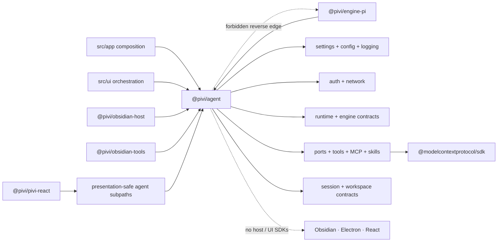

# @pivi/agent package guide

*This file extends the root [AGENTS.md](../../AGENTS.md). Follow root guidance first, then these package-specific rules.*

## Purpose

`@pivi/agent` is the host-neutral aggregate package for reusable Pivi agent capabilities. It gives software hosts one intentional import surface for contracts, tools, sessions, MCP, skills, and generic runtime seams while concrete host adapters remain outside the package. Broad package surfaces are exported as namespaces to avoid flattening conflicting contract names.

## Architecture

Arrows are compile-time dependencies. Concrete engines and host adapters point inward to this package; `@pivi/agent` never points back to them.

## Public entrypoints

- `src/tools/sessions.ts` owns the host-neutral `pivi_sessions` ToolSpec factory over the injected `SessionRecoveryPort`; app composition includes it through the shared base provider, preserving main-Agent and subagent availability.
- `src/session/sessionRecoveryPort.ts` owns the narrow recovery capability; concrete recovery and visible-tab behavior stay in the app host.
- Pivi management confirmation uses the dedicated one-shot `PiviManagementApprovalPort` and normalized plan/error contracts under `src/tools/piviManagement/`; it never shares capability persistent grants.

- `src/index.ts` re-exports the package surface for agent consumers using `auth`, `config`, `engine`, `context`, `logging`, `network`, `prompt`, `plugins`, `ports`, `runtime`, `tools`, `session`, `settings`, `mcp`, `skills`, and `workspace` namespaces.
- `src/network/` owns host-neutral egress policy: IP classification, URL normalization/redaction, DNS pinning helpers (`selectAllowedResolvedAddresses` prefers public IPs and may keep named-host RFC1918/CGNAT/ULA for provider-like purposes), redirect policy, `OriginGrantRegistry` with `grantPrivateOrigins` and `revokeByPurpose` helpers for private-origin exceptions, and `PRIVATE_ORIGIN_GRANT_TTL_MS` for session-scoped configured-origin grants. Concrete HTTP transports implement this policy in host packages; callers receive purpose-scoped injected clients from app composition.
- `src/auth/` owns host-neutral provider credential helpers: stable Pi credential secret IDs, provider environment variable names, supported Pi provider/model-key validation, auth failure hint text, disabled-provider checks, structural API-key/OAuth credential extraction, credential JSON parsing/serialization, provider readiness derivation, and provider-auth gating over the canonical `ModelAuthHost` port. Concrete Obsidian keychain adapters stay in host/app composition; pi-ai model/auth host implementations and provider OAuth flows live in `@pivi/engine-pi`.
- `src/settings/` owns settings contracts/defaults that previously lived in the deleted `@pivi/core` package plus pure settings/display helpers: active-model reconciliation, title-generation model reconciliation, Obsidian tool gates (`allowExternalRead`, `allowBash`, command/eval toggles, allowlists), Pi agent settings materialization/update/normalization (including `customProviders[]` for local/custom API endpoints; `apiKeyRequired` is inferred from local kinds and loopback/private/link-local URLs; fetched or user-entered model rows may persist `reasoning` plus `reasoningMeta.supportedEfforts` from `/v1/models`, and `max_tokens` / `max_output_tokens` as `maxTokens` (65536 when omitted). Users may pin a built-in `catalogModelId` and a `maxTokensOverride` on a custom model (both preserved across fetches); the override is the per-response output cap including thinking and still clamps to the context window. `catalogModelId` lets `@pivi/engine-pi` inherit that catalog row's reasoning behavior when the server card omits reasoning metadata; even without it, thinking levels may be inherited from a matching built-in model id. Settings reads reconcile `visibleModels` against each custom provider's current model ids; users can enter model IDs when a list endpoint is unavailable; a successful `/v1/models` fetch still replaces the stored list while preserving per-row user overrides, and prunes stale active/title/last model selections), environment text parsing/formatting, shared/agent environment-scope routing, structured `ConfigValueRef` sources (`plain`, `secret`, `systemEnvironment`) and secret-key classification in `config/valueSource.ts`, device-local environment registry contracts/projection in `deviceLocalEnvironmentState.ts`, failure-safe config publication helpers in `config/publication.ts` (corrupt preservation, atomic replace, per-path serialized saves), Pi model-key shape validation and settings view types, provider/model display metadata (including custom-provider logo slugs and composer model-family logo detection), and editor-selection-toolbar normalization. Toolbar normalization reserves canonical Pivi action and curated editor-command IDs globally, repairs required actions, deduplicates canonical commands, and deterministically remaps colliding legacy row IDs while remaining idempotent; Pivi Command targets are `inline-edit` or `sidebar`, with legacy/invalid values defaulting to `sidebar`. This package also owns chat UI active-state projection over injected `ChatUIConfig`, settings snapshot/reconciliation, conservative context-envelope calculation and usage projection (read-tool char budgets use a 1:1 token-to-char cap aligned with compaction CJK worst-case estimates; the composer meter arc follows `contextTokens / contextWindow` while its warning state follows `pressureInputTokens / compactionTriggerTokens`), and transient streaming-math escaping. Only a provider aggregate may be marked authoritative; locally decomposed context categories remain estimates, and temporary streaming usage projects the complete active envelope rather than restarting from the current turn. `PersistedPiviSettings`, runtime `PiviSettings`, `DeviceLocalProviderStateV1`, and `DeviceLocalEnvironmentStateV1` are distinct contracts: synced storage omits provider membership, model preferences, `webSearchTools`, custom-provider context limits, and all environment fields; local registries never store secret values inline; runtime projection overlays local state into the existing `PiAgentSettingsView` shape for settings and engine consumers.
- `src/tools/` owns generic tool protocol, diff, todo, task, shell-specific safe argv tokenizers/authorization, the Bash command classifier and structured persistent-permission records, the canonical tool-presentation registry, host-neutral `piviManagement` contracts/ToolSpec factories (`pivi_mcp` / `pivi_skills` / `pivi_commands` / `pivi_prompt` over `PiviManagementPort`), and the directory-backed `tools/webSearch` entrypoint. Detailed registered-tool prompt usage belongs on `ToolSpec.promptUsage` beside its owning factory/schema; prompt composition consumes the actual registered specs rather than duplicating argument contracts in identity switches. `edit` guidance teaches Agents to insert line endings with the shortest unique local substring rather than copying a whole physical line. Because replacement leaves text outside `oldText` adjacent to `newText`, static and registered guidance requires Agents to inspect physical-line boundaries and include line endings when introducing Markdown block syntax. Management tools are sequential; the Pi registry accepts them only through an optional distinct `PiMainOnlyToolProvider` (not via `PiBaseToolProvider` or a name blacklist), and app composition wires that provider later. The port carries no persistence. Web providers share one ordered configuration; capability filtering builds separate search/fetch chains, AnySearch supports anonymous search/extract, and Exa public MCP/direct HTTP remain fixed terminal fallbacks. WebFetch rejects local/private network targets before any provider attempt so the URL is never handed to a third-party extractor. `toolPresentation.ts` is the single source for tool kind, icon, translation keys, visibility/grouping policy, and summary resolver; it returns untranslated title tokens and pure summaries only. React and imperative adapters translate and compose those tokens locally.
- `src/context/` owns host-neutral prompt context formatting, vault context layer loading, XML context stripping, inline context tokens, browser/canvas/editor context value models, date/duration helpers, and the `context/mentions` leaf API for mention types, token parsing (including the built-in image-tool token), wikilink/external-root resolution, and normalization. Obsidian vault lookup/metadata adapters and host SDK helpers such as `getEditorView()` stay outside this package.
- `src/prompt/` owns host-neutral system prompt composition, Pi system-prompt settings/key wrappers, turn prompt and API-only built-in tool-token expansion, title-generation prompt, registered-tool summary text (including MCP inventory and CLI-aware Obsidian tool guidance over injected capability flags), `ContextProvider`, and `PromptContributor` contracts. The shipped prompt-module registry (`core` locked, `workflow` composable, plus user `custom` modules appended after workflow) is the composition source: `buildSystemPrompt` joins enabled non-empty module bodies, then the registered-tools section and runtime appendices. Core safety cannot be disabled or edited; workflow modules honor `promptModules` enablement/`customBody`; empty bodies contribute nothing. Shipped workflow bodies cover transcript cleanup, wikilink authoring, frontmatter, and daily/periodic notes (default on) plus long-line pre-edit normalization (default off). Every prompt rule has one owner: ToolSpec `promptUsage` holds argument contracts and concrete examples (`search` owns search-not-read; `edit` owns the heading/delimiter examples); the registered-tools section holds capability-gated operational guidance (Vault-read stats-first paging, clamp continuation, mutually exclusive coordinate systems, and routing unindexed vault files such as `.pivi/` through the same `read` / `ls` tools); static core holds host-neutral safety (`tool-recovery` for identical-retry, no silent stall, and continuous completion within one turn, `exact-match-editing` for verbatim latest-read `oldText`, `mutation-safety` for rewrite integrity and no draft copies) with cross-references rather than restated examples. `estimateTextTokens` (plus `looksStructured`) lives here so compaction and the Prompt-tab usage panel share one character-based estimator; `estimatePromptUsageSections` reports per-section estimates. `computeSystemPromptKey` incorporates shipped-module enablement/custom bodies and the ordered custom-module list. Registered Vault-read guidance teaches stats and complete-line ranges first, then 1-indexed `offset`/`limit` line pages, with line-relative `startChar` pagination for oversized physical lines using exact `nextStartLine` + `nextStartChar` continuation and no `maxChars` increase; standalone `startChar` remains file-global. Tool-token expansion applies only to the user-authored turn text; it must preserve durable UI text and appended note/selection/context payloads.
- `src/runtime/` owns host-neutral runtime contracts and helpers, including provider-anchored context envelopes and the memory-only per-model calibration registry. Pressure is a same-provider/model anchor plus calibrated trailing and not-yet-counted selected estimates; selected context already represented by current-turn provider usage is not added again. Absent a matching anchor it is a full estimate. Read ceilings are fixed rather than pressure-derived. It also owns `AgentCoreHost`, `AgentCoreRuntime`, application-facing `ChatPorts`, turn preparation/types, `PiChatService`, queues, open-session projection, readiness, connectivity, auxiliary-query contracts, Pi/MCP text extraction, and `CapabilityPersistentGrantCache` (exported from `runtime/capabilitySessionGrants`) as in-memory acceleration of committed persistent Bash/external grants rather than session-duration authority. Concrete Pi session anchoring remains in `@pivi/engine-pi`.
- `src/engine/` owns the generic `AgentEngine` contract only. Concrete Pi SDK adapters, `PiRuntimeHost`, model/provider setup, credential/OAuth services, chat runtime, compaction, JSONL compatibility, and tool-registry composition live in `@pivi/engine-pi`.
- `src/plugins/index.ts` owns the declarative plugin/resource registry skeleton: manifest parsing, registry records, lockfile/trust metadata, resource loader contracts, and contribution models.
- `src/ports/index.ts` owns canonical host capability contracts: workspace file stores, home file stores, async secret stores, temporary sync secret-store compatibility, auth credential services, OAuth flow host callbacks, HTTP, bounded process execution (`ProcessRunRequest` with required limits/timeout/cwd/shell policy and AbortSignal), external opener, logger, clock, runtime UI callbacks, and capability approval (`deny` / `allow-once` / `allow-always` / `cancel`, with no session-duration decision).
- `src/workspace/` owns host-neutral workspace identity (`WorkspaceContext`) and client kind terminology used by runtime host construction.
- `src/session/` owns host-neutral session contracts, linear open-session management, pure path helpers, typed stale/corrupt index failures, user-query metadata, message UI overlay patches, versioned checkpoint/Agent-report schemas, tolerant subagent JSONL parsing, and the device-local session write-ahead journal schema (`sessionJournal.ts`) with bounded entries and a bounded recovered-identity map. Structured artifact references accept vault-relative paths only. `SessionStore` does not expose leaf listing or selection. Pi JSONL compatibility and rebuildable index implementations live under `@pivi/engine-pi` (`session/`); source equality uses file identity, size, mtime, and bounded byte hashes. Filesystem change time is not recorded because metadata-only sync/provenance updates are not session-content mutations. Session path helpers compute pi-compatible live and trash paths only, and filesystem directory creation stays with `SessionManager` or concrete store adapters. Because Pi directory names encode device-local absolute vault paths, history discovery scans every device directory below the shared `.pivi/sessions/` root while creation still targets the current device's Pi-compatible directory. Rebuildable indexes and the session journal stay outside synced `.pivi` (device-local storage).
- `src/skills/` owns skill markdown/frontmatter parsing, loaded skill body content (vault-relative `filePath`/`baseDir` for restore matching plus absolute `absoluteFilePath`/`absoluteBaseDir` for on-disk supporting-file reads), `vault/expandSkillSupportingPaths.ts` (rewrites existing skill-relative supporting-file paths in the `skill` tool result to absolute paths and marks referenced files that are not in the installed tree), slash catalog contracts for command/skill/tool presentation entries, built-in slash IDs, slash-dropdown fuzzy scoring, vault skill inventory/runtime loading (inventory includes disabled skills; runtime context excludes them; a transiently missing or locked `SKILL.md` is skipped, and a locked skills directory keeps the last successful inventory so a concurrent copy cannot blank chat/settings), default bundle orchestration, skill service helpers, change notifications, and default-bundle remote/process helpers that consume injected ports, command environments, and platform context instead of global network or process APIs. `vault/skillPublicationTransaction.ts` owns staged-tree validation, atomic publication, backup rollback, and crash recovery; recovery retries durable metadata when the filesystem commit marker precedes settings persistence. Skills CLI resolution uses the exact pinned `skills` package (`node <cli.mjs>`, `shell: forbidden`); staged publish rejects symlinks/escapes and enforces size/`SKILL.md` limits before atomic replace. First-run default-bundle orchestration requests confirmation through an injected host prompt callback and never constructs host DOM. Catalog `tool` entries are presentation tokens and must not be converted into runtime `SlashCommand` prompt templates. Filesystem ownership remains only in vault-local skill loading/sync paths until a later storage-port slice.
- `src/mcp/` owns MCP config parsing/storage, server management, OAuth/auth stores, callback server, proxy tool specs, connection pool, tester, diagnostics contract, and transport helpers. This directory is the sole raw `@modelcontextprotocol/sdk` import boundary, and `package.json` declares that runtime dependency directly instead of relying on root hoisting. Remote `headers` persist as structured `ConfigValueRef` maps in `.pivi/mcp.json`; secret values reference `SecretStorage` (`pivi-mcp-v-*`) through `mcpValueSources.ts`. Publication stages new secrets before config write and clears obsolete secrets only after successful publish. Settings reads tool inventories from the shared provider cache without connecting; explicit refresh diagnostics list tools without invoking them and import successful results back into that cache. Automatic bridge prefetch covers enabled HTTP/SSE servers. Settings-enabled servers are active for the proxy `mcp` tool; system-prompt inventory lists enabled servers and cached tool names (no composer toolbar selection). MCP SDK transports receive an injected fetch-compatible `McpTransportFetch`; bearer environment lookup receives injected `McpProcessEnv`; OAuth callback port configuration is injected by the product host; concrete Node/Electron fetch implementations stay in host packages. `mcpValidation.ts` enforces reserved server names, remote URL policy, and null-prototype server maps at import/storage/UI boundaries. Stdio MCP is not supported.

## Boundaries

- Do not import concrete host SDKs, platform UI APIs, or concrete host adapter/tool packages (`@pivi/obsidian-host`, `@pivi/obsidian-tools`, `obsidian`, `electron`).
- Do not import `@pivi/engine-pi`, raw `@earendil-works/*`, `@pivi/pivi-react`, or product app/UI modules through `@/*`, `src/*`, or relative paths outside `packages/`.
- Keep concrete host wiring in app/adapter packages. This package should expose capabilities and ports, not decide how a host stores files, secrets, context, or tools.
- `@pivi/engine-pi` constructs Pi `Agent`s and implements the concrete `PiChatService`; it must receive host capabilities (HTTP, process, secrets, fetch, openers) only through constructor/DI arguments typed by `ports/` (or narrow engine-local host seams such as `PiRuntimeHost`).
- Product UI should depend on `runtime/chatPorts`, `runtime/PiChatService`, and `runtime/AuxQueryRunner`, not import `@pivi/engine-pi` or construct runtimes itself. React presentation packages must not own runtime/session application contracts.
- Prefer explicit subpath exports when a source package contains both core and host-specific helpers.
- Inside this package, import with relative paths only. `@pivi/agent/...` subpaths are for cross-package consumers; ESLint `no-restricted-imports` forbids self-referencing package imports under `src/**`.
- Engine custom-provider *installation* lives in `@pivi/engine-pi/installPiCustomProviders`. Settings `customProviders.ts` owns config types/normalization only — do not conflate the two modules.

## Package map

- `package.json` exports the barrel plus explicit curated namespace/leaf subpaths used by app/tests; wildcard exports are forbidden so a new source file cannot become public accidentally. Pi engine leaf exports live on `@pivi/engine-pi`. Check the manifest before documenting a new public leaf.
- `skills/commands/` owns workspace-command defaults, Prompt-variable resolution, catalog entry contracts, and stable host-neutral integration metadata. Host command registration and Note Toolbar behavior remain in app adapters.
- `settings/`, `runtime/`, `config/`, `logging/`, `skills/`, `plugins/`, and `tools/` own the moved source from the deleted `@pivi/core` and `@pivi/tools` packages. Product, package, and test imports should use `@pivi/agent` subpaths.
- `auth/`, `context/`, `prompt/`, `runtime/`, and `engine/` own host-neutral source. Concrete Pi SDK orchestration and provider OAuth/model adapters live in `@pivi/engine-pi` while every host capability arrives through injected ports or narrow host seams.
- `session/` owns host-neutral session contracts, path helpers, typed index failures, open-session manager, checkpoint/Agent-report schemas, and subagent JSONL parsing. Pi SDK-backed JSONL compatibility and indexed-range implementations are exported from `@pivi/engine-pi/session/*`. Private SessionManager rewrite/truncate access is isolated in `@pivi/engine-pi/session/piSessionManagerPrivateAdapter` behind exact Pi pins (`check:pi-pins`, `test:pi-compat`).
- `skills/` owns the moved skills source. Do not add new imports from the deleted `@pivi/skills` package.
- `mcp/` owns the moved MCP source. Do not add new imports from the deleted `@pivi/mcp` package.
- `plugins/` is declarative only: it may describe resources and contributions, but host confirmation, downloads, git/npm commands, local path resolution, UI, and third-party code execution stay in adapters.
- `ports/` supplies the canonical host contracts already used by auth, MCP, skills, runtime, and engine composition.
- There is no package-local build step; source is consumed by the root build.
- There is no package-local typecheck script. Verify boundary changes with the root typecheck, lint, architecture checks, and focused tests for the changed seam.
- Intra-package imports under `src/**` use relative paths; ESLint forbids self-referencing `@pivi/agent/*` imports. Cross-package consumers keep using package subpaths.

## Documentation

Keep durable package rationale in this file. If behavior moves or package boundaries change, update this guide instead of adding separate architecture/spec/note docs.
