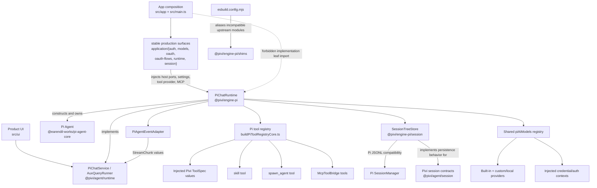

# @pivi/engine-pi package guide

*This file extends the root [AGENTS.md](../../AGENTS.md). Follow root guidance first, then these package-specific rules.*

## Purpose

`@pivi/engine-pi` (`packages/engine-pi/`) is Pivi's Pi SDK adapter package around `@earendil-works/pi-agent-core`, `@earendil-works/pi-ai`, and the Pi coding-agent session implementation. It constructs in-process Pi agents, adapts Pivi tools and sessions to Pi SDK types, configures providers/authentication, and implements host-neutral `PiChatService` / `AuxQueryRunner` contracts owned by `@pivi/agent`.

This is the **only application source package where raw `@earendil-works/*` imports are allowed**. It owns the three exact synchronized Pi pins. Only `src/app/**` and `src/main.ts` (and tests) may import `@pivi/engine-pi`; product UI, host, tools, and React consume `@pivi/agent` contracts instead.

## Architecture

## Key modules

### Chat runtime and streaming

- `src/runtime/piChatRuntime.ts` is the concrete `PiChatService`.
  - It receives a narrow `PiRuntimeHost`, injected network ports, optional MCP services, and a `PiBaseToolProvider`; it must not discover Obsidian services itself.
  - `ensureReady()` resolves the selected model and provider auth, opens or creates the session tree, builds the tool registry and system prompt, loads persisted Pi messages, and constructs an `Agent`.
  - A non-forced readiness call hot-syncs tools and the prompt, and swaps `agent.state.model` in place when the composer selection changed (compaction state is invalidated so thresholds follow the new window). Provider anchors and calibration accept only assistant usage whose provider and model match that resolved selection, so the previous model cannot seed the new model's pressure. Environment changes still require forced reconstruction.
  - `query()` prepares dynamic external-context/tool state and owns the active-turn boundary used by cancellation, one-at-a-time steering, and subagent routing. Accepted steering turns retain their visible-text/request overlays and user-message equivalences through Pi's injected continuation persistence.
  - User content is persisted before prompting. Assistant/tool messages are synchronized at each completed assistant/tool loop before any next provider request, then again after `prompt()` as a defensive final-state sync. After an in-turn compaction, final synchronization appends only the new suffix so compacted history cannot become active again.
  - Transient assistant failures use the Pivi-owned retry state machine rather than pi-coding-agent `AgentSession`. Context overflow remains owned by the existing compaction preflight; other upstream-classified network, rate-limit, timeout, and 5xx failures — plus Pivi-owned matches for Node TLS handshake disconnects, `ECONNRESET`, and exact Connect/First-byte deadline errors — discard the failed attempt from durable/model history and retry through `Agent.continue()` after abortable 2/4/8-second delays. Idle, Total, and vaguely classified deadlines remain terminal. Three retries are allowed. Retry orchestration replaces any live partial attempt before recovery continues, while the error becomes visible only when the policy settles on a terminal failure. Restored legacy error attempts remain visible history but are excluded from LLM replay.
  - Cancellation aborts both the main agent and all background subagents. Changing the session file invalidates the current agent so the next readiness pass hydrates from the new session.
  - An optional engine-local provider override supplies model/auth/stream together. Production construction never sets it; the development-only application surface uses it for the deterministic real-host smoke while preserving the normal Agent, tool, persistence, and event-adaptation path.
  - Automatic compaction uses a fixed bounded 85% trigger and starts an invisible Pass 1 ten context-window percentage points earlier. The runtime reevaluates that policy after every completed assistant/tool batch and may compact inside one user turn before Pi sends its next provider continuation. Selected context is estimated before provider measurement, but is not added again once the current turn's provider usage already includes it. Pi's `buildContextEntries`, `findCutPoint`, and message conversion select the active context and preserve a safe weighted 95/5 turn/tool split as structured model input. Pass 1 summarizes the prefix into an in-memory `NOTE₁`; Pass 2 combines it with the raw tail and produces the validated full-replacement `NOTE₂`. `/compact [instructions]` keeps the same flow and applies instructions only to Pass 2. A manual instruction waiting behind a successful threshold compaction performs a bounded single-pass rewrite of the resulting NOTE; lifecycle/session/model invalidation cancels the waiting request. Both paths use the current chat model, no tools, low thinking, cancellation, and a sampling deadline that follows the configurable provider Total request deadline (`0` disables it; hosts without that setting keep the 120-second fallback); failed sampling uses the bounded full-context fallback and never writes invalid output.
  - A successful run appends an invisible ordinary custom boundary followed by a standard Pi compaction whose `firstKeptEntryId` targets that boundary. Before appending, the runtime revalidates the session, active model, lifecycle generation, and exact active-context fingerprint so a concurrent turn cannot be compacted away. Pi therefore rebuilds the active LLM context as exactly `NOTE₂`, then `NOTE₂ + new messages`, while the append-only pre-compaction JSONL trace remains available to UI history, reopen, and fork. Provider-anchored accounting uses the last valid assistant usage plus calibrated estimates only for trailing entries and selected context; pre-send and in-turn decisions share that pressure. Calibration is memory-only per provider/model and clamped to 0.6–1.5.
- `src/runtime/piChatRuntimeTurn.ts` owns one prompt's event subscription, pre-prompt user persistence, `Agent.prompt()` call, usage/compaction updates, and `StreamChunkQueue` drain/cleanup. It reports durable ids through narrow callbacks while `PiChatRuntime` retains cross-turn state ownership.
- `src/runtime/piChatRuntimeCompaction.ts` implements the two-pass threshold/manual compaction execution described above (pass sampling, boundary append, validated full-replacement NOTE₂, checkpoint merge) as a split-out module of `PiChatRuntime`.
- `src/runtime/piChatRuntimeActiveTurn.ts` defines the `ActiveTurn` record (stream queue, abort controller, routing state) behind cancellation, steering, and subagent routing.
- `src/runtime/piChatRuntimeUsage.ts` owns usage/context-envelope estimation helpers over resolved Pi models; `piChatRuntimeConnectivity.ts` is the connectivity-test entry used by readiness.
- `src/runtime/piChatRetry.ts` owns transient-error classification, retry budget/backoff, failed-attempt context removal, and abortable waiting. It starts from pi-ai's `isRetryableAssistantError` / `isContextOverflow`, then adds Pivi-owned transport matches for Node TLS handshake disconnects, `ECONNRESET`, and exact Connect/First-byte deadline errors that upstream currently misses. Idle, Total, and generic deadline errors are intentionally excluded. Do not import pi-coding-agent `AgentSession`.
- `src/runtime/piAgentEventAdapter.ts` is the sole Pi-event-to-`StreamChunk` translator. It maps text, thinking, tool lifecycle, completion, and errors; do not leak raw `AgentEvent` values to UI/runtime consumers. Context-overflow errors are enriched through an injected diagnostics resolver (serving provider/model, context window, last known usage, and compact/new-session guidance); the serving model on the failed message wins over current settings.
- `src/runtime/piRuntimeHost.ts` defines the narrow host surface available to the runtime.
- `src/runtime/piImageContent.ts` maps Pivi image attachments into pi-ai image content.
- `src/runtime/codexImageGenerator.ts` is a separately injected fetch/token client for the ChatGPT Codex image endpoint; it is not part of the normal chat-agent stream. Its default Codex routing model is `gpt-5.6-sol`, while the image-generation tool reports `gpt-image-2` as the backend image model.

### Tool registry

- `src/tools/buildPiToolRegistryCore.ts` owns registry composition.
  - The app injects host-specific tools as Pivi `ToolSpec` values through `PiBaseToolProvider`.
  - Optional main-Agent-only tools arrive through a distinct `PiMainOnlyToolProvider` (not a flag on `ToolSpec` and not a name blacklist over the base provider). Main registry composition includes those ToolSpecs and appends their names into `RegisteredToolSummary` / the registered-tools prompt. `buildSubagentTools` must never request, receive, or filter this provider — structural absence only.
  - `toPiAgentTool()` in `piToolAdapter.ts` performs the narrow `ToolSpec` → Pi `AgentTool` conversion (including `executionMode` and `prepareArguments` alias shims). Successful alias calls get one live-name/canonical-field reminder through Agent `afterToolCall` (`remindCanonicalToolForm`), because `prepareArguments` runs before execute and would otherwise hide field aliases.
  - The registry adds the vault `skill` tool, conditionally adds `spawn_agent`, and appends MCP bridge tools.
  - It loads vault context layers and returns prompt appendices, registered-tool summary text, and external-context availability alongside the executable tools.
  - A missing base tool provider is an error; the Pi engine does not construct Obsidian tools.
- `src/tools/createSkillTool.ts` exposes loaded vault skill bodies without moving skill parsing into the Pi layer. Result text expands supporting-file paths that exist in the installed skill to absolute paths, lists the skill directory, and tells the model to read those paths with `read` (and list the skill directory with `ls`) rather than joining relative names onto the skill root.
- `src/tools/createSubagentTool.ts` implements blocking and background delegation. Its canonical validated tool input requires `label` (short stable card name), `message` (complete delegated instructions), and `run_in_background`; user permission to use subagents counts as an instruction for safely parallel work, and large context lists should fill the configured maximum with balanced background batches in one assistant response. `false` is reserved for deliberately blocking work. Direct execution defensively treats a missing mode as background, but the schema must not make it optional or reintroduce ambiguous `description`/`prompt` aliases. Valid fenced Agent reports become compact parent text while raw terminal output remains in tool details; malformed output preserves the legacy text path. The parent tool abort signal remains connected through blocking query completion or background result delivery.
- `src/runtime/piAuxQueryRunner.ts` constructs lightweight, low-thinking Pi agents for title generation, inline/refine queries, and subagents.
- `src/runtime/piReadBudget.ts` reserves one fixed per-agent, per-query character allowance synchronously and settles against returned characters. It is not derived from context pressure. Parent and child Agents never share the allowance, sibling reads cannot each claim the full ceiling, and late settles from a previous turn are ignored.
- `src/runtime/piCompactionSampler.ts` is the tool-less, low-thinking sampler dedicated to compaction. It distinguishes its internal sampling timeout from caller cancellation; the budget follows the configurable provider Total request deadline read live from `PiRuntimeHost.settings` (`0` disables the internal timer and omits the pi-ai `timeoutMs` option; a missing/invalid value keeps the 120-second fallback), so a raised Total deadline also unblocks slow-model `/compact` (issue #98). Timeout fallback retries at most once. Automatic compaction retries one failed fingerprint on the next turn, then emits a host-localized warning naming `/compact`. For custom OpenAI-completions providers, its payload hook omits the empty `tools` array synthesized by pi-ai.
- `src/runtime/piBackgroundSubagentJobs.ts` tracks streamed nested tool activity, completion, cancellation, and independently bounded completed-job retention. `subagentConcurrencyLimiter.ts` owns atomic FIFO admission; app composition creates one limiter per plugin workspace and injects it into every chat/aux runner so the configured background concurrency limit is shared across tabs. A lease and abort forwarding span agent creation through prompt completion/error/cancellation. Workspace disposal rejects queued/future admissions before other runtime resources are released. Subagents must not receive `spawn_agent` recursively.

### Models, providers, and auth

- `src/models/piAiModels.ts` owns the shared mutable pi-ai model registry. It installs explicitly supported built-in providers, wires credentials/auth context, and configured custom providers. `streamPiAiModelsSimple` is the sole chat/aux/compaction stream entry: it passes the composition-injected provider fetch explicitly because pi-ai 0.83 provider paths can fall back to `globalThis.fetch`, bypassing the build inject and Obsidian's scoped HTTP adapter. For `openai-codex` it also pins `transport: "sse"` unless the caller already chose a transport, because pi-ai's WebSocket path builds `new WebSocket(url, { headers })` Node-`ws`-style and Obsidian's browser WebSocket rejects that options object (and cannot send auth headers). xAI exposes API-key auth; Anthropic accepts API keys plus `ANTHROPIC_AUTH_TOKEN` bearer headers. `splitProviderAuth.ts` installs the OAuth-only `claude` provider over Anthropic's API implementation. `grokBuildProvider.ts` owns the OAuth-only `grok-build` Responses transport: it mirrors pi-ai's upstream xAI model list under the isolated subscription namespace without local model additions, then applies the subscription proxy, Grok client/model-override headers, and payload normalization. OpenRouter and Kimi For Coding remain dual-auth: pi-ai 0.82+ adds interactive OAuth, while Pivi keeps legacy stored API keys and environment keys working but routes new sign-in through OAuth only. `piviOpenRouterOAuth.ts` mirrors upstream `packages/ai/src/auth/oauth/openrouter.ts`, routes token exchange through the injected provider fetch, and races the localhost callback against host-provided manual redirect/code entry for remote-browser use. Interactive OAuth providers delegate login/logout to pi-ai through `piAuthInteraction.ts`. `registerBundledPiOAuthFlows()` (in `registerBundledPiOAuthFlows.ts`, with the loader list in `registerPiviBundledOAuthFlowLoaders.ts`) statically registers the bundled OAuth loaders with injected fetch before model configuration, avoiding renderer-time dynamic module loading.
- `src/models/installPiCustomProviders.ts` builds OpenAI-completions, OpenAI-responses, or Anthropic-compatible providers. Anthropic-compatible settings retain `/v1` for model discovery (`/v1/models`) but runtime models receive the API root because pi-ai appends `/v1/messages`. Local presets and custom providers on loopback/private URLs may use a stable placeholder API key because upstream clients reject an empty key even when the server ignores authorization. Users can populate `config.models` by fetching `/v1/models` or by entering IDs in Settings; both paths install through `buildCustomProviderModels`. Fetched `/v1/models` cards may advertise `reasoning.supported_efforts` (or a legacy top-level `supported_reasoning_efforts` array); those native levels replace pi-ai's default thinking-level set via `thinkingLevelMap`, and `default_effort` / `default_enabled` become the composer default. If a card omits that metadata, the custom model can still inherit a built-in catalog row's `thinkingLevelMap`, `reasoning`, and advertised default thinking level: the lookup id is the user-declared `catalogModelId` when set (matched exactly or after stripping `provider/` prefixes, and preserved across re-fetches by model id), otherwise the server model id (exact or prefix-stripped, e.g. `deepseek-v4-flash-0731`). When no exact id is present, inherit also uses a family stem `/^[a-z]+[0-9]*/i` of length at least 5 (so `qwen3.8-27b` inherits a catalog `qwen3` row's thinking levels, while `gpt` does not family-match). Absent both, custom OpenAI-compatible models stay non-reasoning with `supportsReasoningEffort: false`. Reasoning custom OpenAI-compatible models whose id, catalog id, or name matches `/qwen/i` also set `compat.thinkingFormat: "chat-template"` with `enable_thinking` / `reasoning_effort` / `preserve_thinking` so SGLang/vLLM Qwen templates see the UI thinking level; other custom OpenAI-compatible models keep the OpenAI top-level `reasoning_effort` field only. Custom Qwen3.8 ids (`qwen3.8`, `qwen3-8`, `qwen38`) that omit advertised `supported_efforts` use a built-in map of official levels only (`off` / `low` / `medium` / `xhigh`, default `xhigh`) instead of inheriting a broader catalog map. A successful fetch is authoritative for the stored model list: stale `visibleModels` keys are reconciled away in `@pivi/agent` settings reads, and the app fetch facade prunes active/title/last model selections that reference removed model ids. The same cards may advertise an output ceiling as `max_tokens` (preferred) or `max_output_tokens`; that value becomes the request `maxTokens` cap unless the user set `maxTokensOverride` on the custom model row (preserved across fetches, still clamped to the context window). An advertised or overridden cap is marked authoritative so compaction reserves the complete request output allowance for servers that validate input plus maximum output against the context window. Absent both, custom models fall back to 65536 even when `max_model_len` / `context_window` is much larger, which truncates long thinking as `stopReason: length`.
- Ollama, LM Studio, and llama.cpp model metadata may be incomplete until the server loads a model. `PiChatRuntime` refreshes their model/context metadata after the first successful prompt.
- `src/models/piModelRegistry.ts` caches models by `provider/modelId`, builds UI options (model-family logo, custom-provider display names, and kind-logo fallbacks), and tracks whether context-window metadata is authoritative.
- `src/models/piModelEnv.ts` resolves settings fallback models, applies device-local context-window overrides to cloned runtime model values (including output-cap clamping), and delegates credential resolution through Pivi auth ports and `piAiModels`.
- `src/auth/piProviderCredentialStore.ts` adapts injected synchronous secret storage to pi-ai's credential store and migrates legacy environment/keychain formats only for providers recorded in durable settings. Each read, write, refresh, and delete targets one provider's canonical key; no fallback crosses API-key and plan namespaces. `migrateSplitSubscriptionOAuthCredentials()` preserves any existing plan credential, clears legacy OAuth from `xai`/`anthropic`, and records only successfully OAuth-backed model namespaces for settings-load migration. `membershipAwareCredentialMigration.ts` drives that migration from a legacy provider-membership snapshot during settings load.
- `src/auth/piProviderOAuthService.ts` owns interactive provider OAuth for OpenAI Codex, Grok Build (`grok-build`), and Claude (`claude`): pi-ai login/logout uses the exact provider id and therefore touches only that provider's credential. OAuth descriptions explain the required xAI account or Claude Pro/Max subscription without folding the authentication method into the provider name. Legacy Codex auth migration still uses injected storage ports. `piAuthInteraction.ts` maps browser URLs, device-code pages, and manual-code prompts onto the OAuth host; manual-code input observes both pi-ai's prompt signal and the Pivi login cancellation signal. `piviXaiOAuthDeviceFlow.ts` uses injected fetch and prefers `verification_uri_complete` over `verification_uri` before opening the browser.
- `src/models/piThinkingLevels.ts`, `piChatUiConfig.ts`, and `piSettingsCoordinator.ts` project Pi model/reasoning behavior into Pivi-owned UI/settings contracts.

## Session relationship

- `@pivi/agent/session` owns host-neutral contracts, identity, path helpers, UI metadata types, and session-management interfaces. It must not import Pi SDK types.
- `src/session/` implements those contracts using Pi JSONL and `SessionManager`:
  - `sessionJsonlIndex.ts` owns the rebuildable session index: UTF-8 byte offsets, projection metadata, per-line hashes, append-only checkpoints, migration markers, bounded source fingerprints, incremental append refresh, rewrite invalidation, and verified indexed-line reads. Index files live in a configured device-local root (`sessionJsonlIndexLocation.ts`, typically `~/.pivi/session-indexes/<vault-key>/`) rather than beside synced `.pivi/sessions/*.jsonl`; legacy colocated `.pivi-index` sidecars migrate on read. JSONL remains authoritative; low-level stale/corrupt validation raises the typed errors owned by `session/types.ts`, while read-only consumers discard that optimization and rebuild before returning data. The append refresh self-heals the same way: a stale, corrupt, or missing index after an already-validated append is rebuilt from the authoritative JSONL, and the rebuilt tail must equal the exact appended entry IDs so a concurrent write during refresh still fails. Held mutation fingerprints never auto-recover.
  - `sessionRecovery.ts` classifies journal/source divergence and creates explicit recovered sessions without overwriting an externally changed JSONL file; all recovery source rewrites are atomic (temp + rename with temp cleanup).
  - `sessionTreeStore.ts` isolates Pi `SessionManager`, append/sync/fork/truncate behavior, compaction entries, and Pivi custom JSONL entries. After each successful append it seals continuation bytes into the bound device-local session journal and marks them confirmed. Journal binding returns an ownership token whose release is compare-and-clear: shutdown from an older application instance cannot unbind a newer reload. Fork failure compensation uses only the failed manager's exact replacement session path: it deletes a same-directory `.jsonl` candidate, never scans the session directory, reopens the unchanged source for a live store, and reports an actionable owned residual if cleanup fails. Its full-replacement compaction operation appends the invisible custom boundary before the standard compaction without rewriting prior JSONL. The linear LLM-context view includes trailing tool-result messages even though the visible UI prefix does not, so context pressure and in-turn compaction account for a large tool result before the next provider continuation. Import Pi session types from the package root; private `dist/core/*` paths are not a supported source boundary. Private SessionManager members (`fileEntries`, `_buildIndex()`, `_rewriteFile()`, `flushed`) are accessed only through `piSessionManagerPrivateAdapter.ts`, which asserts capabilities and throws an actionable exact-pin compatibility error before mutation.
  - `piSessionStore.ts` implements the package-level `SessionStore` and maps durable JSONL sessions to Pivi `SessionRef`, `ChatMessage`, usage, metadata, and UI context. Identity, history summaries, usage, UI context, and bounded message pages read verified indexed lines; full `getMessages()` remains the explicit runtime/compatibility path. Recoverable deletes move JSONL from `.pivi/sessions/` to a mirrored `.pivi/trash/sessions/` tree and stamp delete time on mtime; history listing stays on the live tree. Absolute external-context paths are removed at every JSONL write and overlaid from an injected device-local store on read. Startup/lazy-open migration consults the sidecar marker, single-flights each file, and rewrites only legacy JSONL while preserving line order/final-newline shape; marker-complete files never reread the body. Startup warns and skips a malformed session so one corrupt JSONL cannot block the plugin; explicitly opening that session still fails with its file/line.
  - `agentMessageHistory.ts` compares and sanitizes Pi message history before persistence or LLM submission.
  - `messageMapper.ts` reconstructs visible Pivi messages, tool calls, images, and UI overlays from Pi entries. A complete `message_ui.contentBlocks` overlay remains authoritative, while a final-segment-only overlay reconciles matching tool/subagent presentation by ID without dropping the earlier Pi-native block order. `subagentMessageRecovery.ts` repairs a missing or incomplete `message_ui` subagent projection from Pi-native `spawn_agent` input/result fields, while a complete persisted `SubagentInfo` remains authoritative.
  - `piContextCompaction.ts` owns the fixed 85%/10%/95:5 policy, vault-native prompt/schema validation, CJK-aware conservative estimates (via `@pivi/agent/prompt` `estimateTextTokens`, which it re-exports), Pi-native cut-point/structured message conversion, prefix fingerprints, and checkpoint merge/rendering.
  - `visibleSessionEntries.ts` identifies the latest visible user/assistant entry.
  - `sessionJsonlRangeReader.ts` serves bounded recent/older message pages (`openRecentSessionJsonlMessages`, `readOlderSessionJsonlMessages`) from verified indexed lines.
  - `sessionMessageProjection.ts` projects Pi entries into visible user/assistant text groups with normalized, hashed durable content for index metadata.
- Pivi restores an existing session as a **linear append-order conversation**, not as a selected Pi tree leaf. Tree support remains a compatibility detail used for old files and creating a fork in a new session file.
- Runtime agent state is rebuildable; the JSONL session file is the durable source of truth.
- Device-local external-context overlays are deliberately not part of durable session identity. Fork copies the source overlay to the new session file; redo reuses the same session overlay and recaptures current capabilities when the turn is submitted again.
- `SessionTreeStore` deliberately uses isolated Pi internals (`fileEntries`, `_buildIndex()`, `_rewriteFile()`, `flushed`) for the one-time eager header bootstrap and rewind because upstream lacks equivalent public APIs. Those members are reached only through `piSessionManagerPrivateAdapter.ts`. Normal message, custom-entry, and compaction writes use Pi's public typed append methods and must not rewrite prior JSONL bytes.
- Source imports Pi's public session, compaction, and message exports from the package root. The production build narrows that root import to a generated facade over upstream `core/session-manager.js`, `core/compaction/index.js`, and `core/messages.js` because the root ESM entrypoint statically re-exports the CLI/TUI; keep this build adaptation aligned with the consumed public exports and covered by production-build verification.
- Do not widen that facade to `AgentSession` without an explicit architecture and bundle review. In the 0.81.1 graph measured before the 0.82.0 pin bump, a forced production import increased the measured plugin bundle from about 3.0 MiB to 7.9 MiB and required substantially broader config/pi-ai compatibility shims.

## Boundaries

- Depend on `@pivi/agent` for host-neutral contracts, ports, runtime seams, and tool protocol types. Do not create a reverse dependency from `@pivi/agent` into this package.
- Raw `@earendil-works/*` imports belong only in this package. Do not spread Pi SDK types into `@pivi/agent`, host packages, app code, UI, tools, or React.
- Production composition in `src/app/**` and `src/main.ts` may import only the responsibility-scoped `@pivi/engine-pi/application/{auth,models,oauth,oauth-flows,runtime,session}` surfaces; focused engine compatibility tests may use declared leaf exports. Product UI must depend on `PiChatService` / `AuxQueryRunner` from `@pivi/agent/runtime` and injected `ChatPorts`, not construct `PiChatRuntime` or import this package.
- Implement against `@pivi/agent` contracts at the boundary (`PiChatService`, `AuxQueryRunner`, `ToolSpec`, `StreamChunk`, `SessionStore`, and related runtime, settings, and session types). Keep files under `application/` as explicit named-export lists rather than wildcard barrels so additions receive deliberate architecture review and unrelated responsibilities are not eagerly loaded together.
- Do not import `obsidian`, `electron`, `@pivi/obsidian-host`, `@pivi/obsidian-tools`, `@pivi/pivi-react`, product UI, or app implementation modules here.
- Host filesystem, secrets, HTTP, process environment, OAuth browser opening, and fetch behavior must arrive through `@pivi/agent/ports`, `PiRuntimeHost`, or explicit function arguments. Do not rely on `window.fetch`; composition passes the scoped provider client into `configurePiAiModels`, and `streamPiAiModelsSimple` forwards it explicitly to pi-ai. The esbuild inject of `@pivi/obsidian-host/bundledFetch` remains a compatibility fallback for upstream free `fetch` identifiers, but does not cover `globalThis.fetch`.
- Keep concrete Obsidian tool construction in app composition. The registry accepts a `PiBaseToolProvider`; it does not know how host tools work.
- Keep Pi compatibility casts and upstream-internal access narrow and documented. Do not normalize the rest of the package around Pi's types.
- Inside this package, import with relative paths only. Keep the production composition surfaces stable under `application/`; implementation leaf subpaths exist for focused compatibility tests, not app wiring.

## Shims

- `compatibility-manifest.json` is the canonical lifecycle inventory for upstream-shape-dependent Pi adaptations. Every entry carries the exact current Pi version, reason, implementation paths, verification tests, removal condition, and issue `#113`; `npm run check:pi-compatibility` validates metadata/path coverage and is part of `check:boundaries`. Ordinary Pi adapters and Pivi product behavior do not belong in this manifest.
- `src/shims/piCodingAgentConfig.ts` replaces upstream coding-agent config because its top-level `import.meta.url` is incompatible with Pivi's bundled CommonJS `main.js`. Its version/constants must stay aligned with the installed Pi package.
- `src/shims/piAiCompat.ts` provides the compatibility API expected by upstream code while routing model lookup and streaming through Pivi's shared `piAiModels` registry. It also supports dynamically registered API providers and Pivi's environment-key shim.
- `src/shims/piAiEnvApiKeys.ts` replaces upstream dynamic `import("node:" + "fs")` behavior, which Electron's renderer can treat as a URL fetch. It uses synchronous Node modules behind a configurable environment host.
- `src/shims/signalExit.cjs` supplies the callable CommonJS shape expected by `proper-lockfile`. Exit cleanup is intentionally a no-op inside Obsidian.
- These files are activated by shared aliases/plugins under `build/create-build-options.mjs` and `build/plugins/`, used by both production and bundle analysis. A shim file alone has no effect.
- `.github/workflows/pi-compatibility-canary.yaml` runs weekly or manually against the newest synchronized stable Pi version newer than the pin. It mutates only its ephemeral checkout, runs the expanded `test:pi-compat` suite plus a production build, and updates one marker-backed comment on issue `#113`; failures are informational rather than required `main` checks.

## Gotchas

- Obsidian loads a CommonJS renderer bundle. Upstream `import.meta.url`, ESM/CJS interop assumptions, and dynamic `node:` imports can fail only at plugin load time even when TypeScript succeeds.
- `build/postprocess/rewrite-node-imports.mjs` rewrites remaining dynamic `node:` imports/requires and fails the build if any survive. Provider upgrades can change minified patterns and require deliberate shim/rewrite updates with matching fixtures.
- The shared `piAiModels` registry is mutable and module-global. Configure credentials, auth context, and custom providers before constructing runtimes; refresh the model cache after provider changes.
- Do not assume `process.env` contains plugin settings. Provider credentials normally resolve through injected auth context and SecretStorage; Obsidian does not inherit a pi-coding-agent shell environment.
- Context-window values for custom/local models may be synthetic. Auto-compaction preflight only trusts authoritative metadata; local model metadata can become authoritative after first-load refresh.
- Tool registry changes also affect the system-prompt key. Keep executable tools, registered-tool summaries, context appendices, and external-context availability synchronized.
- The persisted user text may differ from the API prompt because the latter contains command/context/MCP transformations. Persist `PreparedChatTurn.displayContent` in the message UI overlay so command badges survive history restoration, while session synchronization uses explicit user-message equivalences to avoid duplicate turns.
- Pi may defer creating a session file until an assistant message. `SessionTreeStore.create()` intentionally performs one bootstrap rewrite for the header and updates Pi's private `flushed` flag; subsequent typed writes are true appends. Truncate and migration remain explicit rewrite boundaries.
- Session index offsets are byte offsets, never JavaScript string offsets. Keep sidecar writes append-only during normal session appends, invalidate on every full JSONL rewrite, and verify the source fingerprint plus line checksum before returning indexed content.
- A live `SessionTreeStore` must validate its held source fingerprint before append, truncate, or fork. On mismatch, evict it and throw the typed stale error before Pi mutates memory or disk. Post-append refresh must match the exact returned Pi entry IDs; a stale/corrupt/missing index at that point is an outdated optimization (cloud file replacement can invalidate inode/mtime without touching bytes), so it is rebuilt from the authoritative JSONL and the rebuilt tail must still equal those entry IDs.
- `agent_end` and post-`prompt()` synchronization are intentionally redundant safeguards; preserve idempotent missing-message detection when changing persistence.
- Background subagent chunks are routed to the active `spawn_agent` tool call when owned by the current turn; otherwise they go to runtime listeners. Preserve tool-call IDs when changing this flow.
- The registered tools prompt and `spawn_agent` schema both state the live plugin-wide concurrency limit. Saving subagent settings must refresh every open runtime prompt; increasing the limit also drains the existing FIFO queue immediately.
- The registered-tools prompt in `packages/agent/src/prompt/obsidianAgentTools.ts` must list every schema `required` field in its `Required parameters` sentence. The `spawn_agent` schema requires `label`, `message`, and `run_in_background`; the prompt must list all three. Weaker models rely on the prose required-params list rather than re-reading the JSON schema, so a mismatch causes first-turn tool-validation retries before the model recovers.
