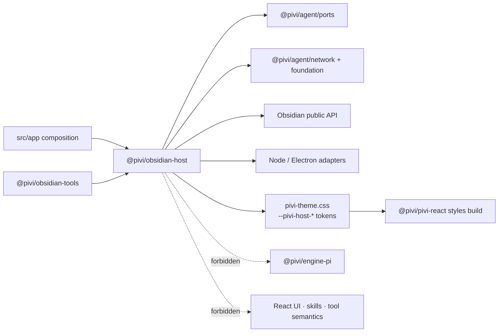

# @pivi/obsidian-host package guide

*This file extends the root [AGENTS.md](../../AGENTS.md). Follow root guidance first, then these package-specific rules.*

## Purpose

`@pivi/obsidian-host` is the Obsidian/Electron host adapter layer. It wraps vault APIs, file stores, settings persistence, shared storage, secret storage, host context, path normalization, and renderer compatibility helpers.

## Architecture

This package translates platform capabilities into host-neutral ports. App composition, not the engine or UI, connects those adapters to product behavior.

## Public entrypoints

- `src/index.ts` re-exports the package surface. Add new intentional host APIs here.
- `src/obsidianVaultApi.ts` wraps Obsidian `App` vault operations: note reads/writes/edits, file resolution, tree/list, move/trash/folder creation, open-in-leaf, scan-based search scoped to a note or folder, note info, links, backlinks, tag/graph analysis, base-file/view inspection, recent files, attachment metadata, and binary attachment creation with Obsidian markdown links. Base lookup uses direct path/metadata resolution, and unresolved-only graph analysis reads metadata without enumerating files. Mutating paths use `requireAgentVaultMutationPath` (containment + managed-namespace policy); delete/move-source/mkdir use recursive mode so ancestors of managed roots are rejected. Before editing, overwriting, appending, prepending, changing properties, moving, deleting, or restoring an existing `.md` / `.canvas`, the API requires `fileRecoverySnapshot.ts` to complete. Folder move/delete recursively snapshots all supported descendants before host mutation; any failure aborts the whole operation. New paths and unsupported attachments need no File Recovery snapshot; attachment deletion still uses Obsidian trash.
- `src/vaultEditMatch.ts` owns exact occurrence counting, replacement, ambiguity errors, and straight-versus-curly quote mismatch diagnostics used by `ObsidianVaultApi.editNote`.
- `src/fileRecoverySnapshot.ts` resolves the enabled `file-recovery` internal plugin and calls private `forceAdd(path, content)` for `.md` / `.canvas` files before Pivi vault mutations. Disabled/unavailable File Recovery, a missing private API, and capture failure are explicit blocking errors.
- `src/externalFileApi.ts` wraps Node.js `fs` for reading and listing files outside the Obsidian vault by absolute path. It enforces allowed-directory realpath containment and is the host-neutral filesystem adapter consumed by external read/list tools.
- File-store contracts now live in `@pivi/agent/ports`; this package implements host adapters for those ports.
- Domain service contracts live with their owning `@pivi/agent` modules; app workspace initialization remains an app-composition contract.
- `src/bootstrap/` defines host context, app storage, and tab manager state contracts.
- `src/storage/` implements vault file, home file, and shared app storage adapters. Product settings normalization is injected by the app composition layer. Deleted chats are not stored in plugin `data.json`; leftover `deletedSessionFiles` marks are consumed once so callers can relocate JSONL into `.pivi/trash/sessions/`.
- `src/settings/` owns vault settings persistence and the codec contract used to inject product/runtime normalization plus an optional pre-save projection. Product defaults live in `@pivi/agent/settings` and `@pivi/agent/runtime`; Pi-specific normalization and device-local-field stripping live outside this package. App composition injects `createPiviSettingsCodec`, which may commit device-local provider and environment state in `prepareForSave` before writing stripped `PersistedPiviSettings` (`VaultPersistedPiviSettings`); `SharedStorageService.savePiviSettings` surfaces synced write failures with a localized Notice while preserving committed local authority. Settings load/save use `@pivi/agent/config/publication` for corrupt-source preservation (`.corrupt-*` artifacts), parse diagnostics, serialized per-path saves, and atomic replacement when the file store supports rename. Runtime load still uses the full `PiviSettings` bag (`StoredPiviSettings`).
- `src/path/` owns filesystem/vault path normalization and safety helpers. `normalizePathForVault` remains the read/display helper and may return an external/absolute path when input is outside the vault. Mutating vault operations must call `requireVaultRelativeMutationPath`, which fails loudly on empty paths, absolute/drive/UNC forms, traversal, NUL, and symlink-parent escape (using nearest-existing-ancestor realpath containment). Agent-facing vault mutations use `requireAgentVaultMutationPath` (containment then managed-namespace policy): after canonicalization it rejects exact/descendant targets under Pivi-managed MCP (`.pivi/mcp.json` + temp/backup/corrupt siblings, `.pivi/mcp-oauth/**`), Skills (`.pivi/skills/**`, staging/CLI metadata and `skills-<operation>-*` transaction roots including remove), and Commands (`.pivi/commands/**`, `.pivi/templates/**`), with `mode: 'recursive'` also blocking ancestors for delete/move-source/mkdir. Errors name the owning `pivi_mcp` / `pivi_skills` / `pivi_commands` tool. Unrelated `.pivi/*` paths stay allowed. Policy does not cover Bash/eval or manual user filesystem edits; Settings/coordinators persist via FileStore, not `ObsidianVaultApi` mutation methods.
- `src/authContextHost.ts` adapts the canonical auth context host port to system environment variables, filesystem existence checks, and home-directory lookup for Pi auth resolution.
- `src/secrets/` re-exports the canonical provider secret-storage surface (the implementation lives in `@pivi/agent/auth/providerSecretStorage`).
- `src/shims/` holds narrow renderer-compatibility shims activated by the build (for example `debug.ts`, a no-op replacement for the upstream `debug` module).
- `src/providerLegacyAuthStore.ts` adapts the canonical provider legacy auth store port to the vault-local `.pivi/auth.json` file used only for old Codex credential migration.
- `src/scopedHttpClient.ts` implements the streaming scoped HTTP client (deadlines, encoded/decoded byte limits, content types, redirects, DNS pin of the selected allowed address subset) over `@pivi/agent/network` policy. Each redirect hop gives socket acquisition plus TCP/TLS handshake its Connect budget, then starts a separate First-byte budget while waiting for response headers; body idle and whole-request Total budgets remain independent, and `totalMs` / `idleMs` of `0` disable those timers. `src/createPiviNetworkClients.ts` builds purpose-scoped clients (`provider`, `mcp`, `web-search`, `web-fetch`, `image`, `skills`, connectivity) and a shared `OriginGrantRegistry` for private-origin exceptions; provider fetch reads a mutable deadline object (`setProviderDeadlines`, defaults `600000`/`0`) so later requests pick up changes without recreating clients; configured MCP and custom-provider private origins receive session-lifetime grants re-issued on settings save (via `revokeByPurpose` + `grantPrivateOrigins`) and cleared on unload, while the registry also supports short-lived grants for other callers. `src/bundledFetch.ts` is esbuild-injected so free `fetch` identifiers resolve to the scoped provider client without assigning `window.fetch`. `src/nodeFetch.ts` remains a legacy export surface over scoped fetch; do not reintroduce global fetch patching. `src/obsidianHttpClient.ts` adapts scoped clients to the `HttpClient` port. `src/electronCompat.ts` and `src/systemProcessRunner.ts` cover other renderer/Electron compatibility gaps; `systemProcessRunner` is the bounded process primitive: required byte limits/timeout/cwd/shell policy, streaming truncation metadata, AbortSignal, process-tree termination with forced-kill escalation, and termination-kind results (exit/signal/timeout/abort/spawn-error/forced-kill). Shell is forbidden unless a reviewed adapter declares an explicit reason (for example Windows `.cmd`).
- `src/cli/obsidianCliTransport.ts` executes the official Obsidian CLI through the injected `ProcessRunner` with vault cwd policy rather than a private unbounded spawn. `src/cli/officialObsidianCli.ts` reads the host `obsidian.json` (`cli: true`) from macOS Application Support, Windows `%APPDATA%`, or Linux `~/.config`.
- `styles/pivi-theme.css` maps Obsidian theme variables into the `--pivi-host-*` contract consumed by `@pivi/pivi-react`; the root CSS build prepends it directly before the React style manifest. It is a build input, not a JavaScript package export.

## Boundaries

- This package may import Obsidian API types, Electron/renderer globals, and Node platform modules needed for host adaptation.
- Implement host adapters against `@pivi/agent/ports` (file stores, secrets, HTTP, process, openers). App composition injects those adapters into the Pi engine; the engine must not import this package.
- Do not import UI components or Pi engine implementation details. Expose host capabilities through typed contracts.
- Do not import `@pivi/engine-pi`, `@pivi/agent/skills`, `@pivi/agent/tools`, or concrete Obsidian tool implementations; app composition and tool packages should add product/runtime/tool semantics above the host layer.
- Keep path validation and vault containment checks here when they protect host file operations.
- Preserve explicit errors for missing vault paths, unsafe paths, storage failures, and unsupported host operations.
- Obsidian public API is preferred for vault operations; CLI is only for capabilities the public API cannot provide.

## Package map

- `package.json` exports the barrel and explicit leaf subpaths (`authContextHost`, `bootstrap/hostContext`, `bootstrap/storage`, `bootstrap/types`, `bundledFetch`, `cli/obsidianCliTransport`, `cli/officialObsidianCli`, `createPiviNetworkClients`, `electronCompat`, `externalFileApi`, `nodeFetch`, `obsidianHttpClient`, `openExternalUrl`, `path`, `providerLegacyAuthStore`, `scopedHttpClient`, `settings/piviSettingsStorage`, `storage/sharedStorageService`, `systemProcessRunner`). The canonical vault edit matcher is intentionally available through the root barrel beside `ObsidianVaultApi`. Add new intentional leaf APIs to both `src/index.ts` and the matching export entry.
- There is no package-local build step; source is consumed by the root build.
- There is no package-local typecheck script. Verify host changes with the root typecheck and targeted tests for affected tools/runtime/UI.

## Documentation

Keep durable package rationale in this file. If behavior moves or package boundaries change, update this guide instead of adding separate architecture/spec/note docs.
