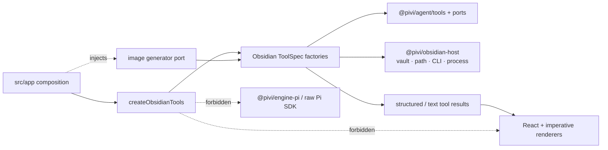

# @pivi/obsidian-tools package guide

*This file extends the root [AGENTS.md](../../AGENTS.md). Follow root guidance first, then these package-specific rules.*

## Purpose

`@pivi/obsidian-tools` provides concrete Obsidian-native agent tools. It adapts abstract tool contracts from `@pivi/agent/tools` to Obsidian vault operations, CLI-backed gaps, Obsidian file-history recovery, and injected image generation that persists outputs as Obsidian attachments. The host-neutral `pivi_sessions` tool and recovery port belong to `@pivi/agent` and are composed by the app's shared base provider.

## Architecture

Tool execution depends on host adapters and host-neutral contracts only. Engine-specific image/provider wiring is injected from app composition.

## Public entrypoints

- `src/index.ts` re-exports all tool creators, settings, and types. Default export is `createObsidianTools`.
- `src/createObsidianTools.ts` constructs the full `ToolSpec[]` from an Obsidian `App`, settings, and optional image generator. Live generic names are `read` / `write` / `edit` / `ls` / `search` / `bash` / `mkdir` / `move` / `delete`. When the vault path is known, it injects the vault root as an implicit ExternalFileApi allowed directory so unindexed vault files (including `.pivi/skills`) can be read and listed through `read` / `ls` without a Settings grant; that root is not listed in Persistent permissions. `allowExternalRead` only gates paths outside the vault. Top-level `*_external` tools are not registered.
- `src/obsidian/` contains per-tool factories plus their shared dependency, read-range, and result helpers. Tool factories accept `ObsidianToolDeps` and return `ToolSpec` values.
- `src/obsidian/deps.ts` defines shared tool dependencies: vault API, external-file API, CLI transport, settings, vault name, and optional image generator.
- `src/obsidian/readNote.ts`, `writeNote.ts`, `editNote.ts`, `search.ts`, `listPath.ts`, `mkdir.ts`, `movePath.ts`, `deletePath.ts`, `openPath.ts`, `noteInfo.ts`, `links.ts`, `properties.ts`, and `attachment.ts` define the core vault tools (`read`, `write`, `edit`, `search`, `ls`, `mkdir`, `move`, `delete`, `obsidian_open`, `obsidian_note_info`, `obsidian_links`, `obsidian_properties`, `obsidian_attachment`) over the injected vault API; mutating paths go through host `requireAgentVaultMutationPath` (containment + Pivi-managed MCP/Skills/Commands namespace rejection with `pivi_*` tool guidance). `read` and `ls` route internally: vault-indexed paths use the Vault API, and an index miss that still exists on disk (or an absolute path) uses ExternalFileApi (`unmanagedVaultPath.ts`). `edit` owns literal exact replacement, including local newline insertion, delimiter removal/repositioning, and explicit `replaceAll: true`. Multiple `edits[]` items match the original file, not incrementally; overlapping spans fail. Its prompt usage must teach shortest-unique-substring newline edits and explain that surrounding text remains adjacent and Markdown block markers require physical-line boundary handling. `search` `promptUsage` owns search-not-read: locate notes and match positions; `context: true` dumps are not a substitute for reading note bodies. Optional `path` limits the scan to one Markdown note or a folder; omit it only for a vault-wide search. Listing queries (`*`, `**`, empty, `path:`-only) error toward `ls`. `ls` filters direct-child names with an optional case-insensitive substring `query`, then pages the filtered rows with a default 50-entry / maximum 200-entry 0-based `offset`/`limit`, returns `nextOffset`, and enforces a 50,000-character serialized-result ceiling so one large folder cannot overflow the next model request.
- `src/obsidian/tasks.ts` defines `obsidian_tasks` (CLI-backed; no public task index API). `src/obsidian/command.ts` and `src/obsidian/eval.ts` define the separately gated `obsidian_command` / `obsidian_eval` tools (`allowCommand` / `allowEval`).
- `src/obsidian/history.ts` defines `obsidian_history`; it uses the Obsidian CLI history commands to list, read, and restore stored file versions, including deleted files when history exists. Restore asks the host vault API to snapshot an existing destination first and blocks CLI mutation if that required snapshot fails; a deleted destination has no current state to capture.
- `src/obsidian/daily.ts` defines `obsidian_daily`; it uses the official Obsidian CLI daily-note commands and avoids daily-notes internals.
- `src/obsidian/graph.ts` defines `obsidian_graph`; it analyzes orphans, deadends, and unresolved links through the injected vault API / MetadataCache, without shelling out.
- `src/obsidian/tags.ts` defines `obsidian_tags`; it lists tags and tag details through the injected vault API / MetadataCache, without shelling out.
- `src/obsidian/base.ts` defines `obsidian_base`; list/views actions use the vault API and `.base` YAML parsing, while query remains explicitly CLI-backed.
- `src/obsidian/markdownStructure.ts` defines `obsidian_markdown_structure`; it extracts Markdown headings with line numbers and character counts so agents can inspect large notes before range-reading sections.
- `src/obsidian/generateImage.ts` defines `obsidian_generate_image`; it consumes an injected image-generator port, saves binary output through `ObsidianVaultApi`, and optionally inserts standard Markdown `` embeds into notes. It intentionally ignores Obsidian's wiki-link attachment preference because wiki-style image embeds are not reliably recognized in every context.
- `src/obsidian/bash.ts` defines `bash`; it is registered only when `allowBash` is enabled, matches structured persistent Bash permissions after shell-safe argv classification, prompts through `CapabilityApprovalPort` on miss, runs single-line commands through the user login shell (`$SHELL -lc`, fish `-c`, or `cmd.exe /d /s /c` on Windows), constrains cwd to the vault, and invokes the injected process runner with shell forbidden at the Node spawn layer. Authorization rejects control operators, substitution, redirects, and unsupported syntax for persistable Always grants on both POSIX shells and cmd.exe. Its schema describes it as a lowest-priority host diagnostic, never a vault file tool.
- `src/bashAllowlist.ts` owns platform-specific safe defaults (`which`/`type`/`pwd` on POSIX and `where`/`cd` on cmd.exe) and matches structured persistent Bash permissions from `@pivi/agent/tools`.
- `src/capabilityApprovalGate.ts` owns bash/external miss handling against `CapabilityApprovalPort` and persistent grant checks.
- `src/loginShell.ts` resolves the user's login shell and builds argv for `bash` single-line commands (`$SHELL -lc`, fish `-c`, or Windows `cmd.exe /d /s /c`).
- `src/obsidian/readExternal.ts` and `src/obsidian/listExternal.ts` remain helper factories for ExternalFileApi reads/lists. They are not registered as top-level tools; `read` / `ls` call them internally for unindexed vault and absolute paths. Vault-contained paths are always allowed. Outside the vault access is gated by `allowExternalRead`; paths outside allowed roots prompt through `CapabilityApprovalPort`.
- `src/obsidian/resolveExternalToolPath.ts` converts vault-relative external tool paths to absolute paths before approval and filesystem access.
- `src/obsidian/readShared.ts` and `src/obsidian/readTypes.ts` own shared line-span, stats, and complete-line range pagination used by `readNote.ts` (including internal ExternalFileApi routing) plus UTF-16-safe character pagination. An omitted `maxChars` uses the configurable Tools default (100,000 characters initially); an explicit value overrides that default up to the fixed 500,000-character ceiling. The allowance does not shrink with context pressure; compaction preflight handles overflow before the next model request. Main and child Agents use independent turn allowances, and parallel siblings share their Agent's turn ceiling. Explicit line ranges use 1-indexed `offset`/`limit` and return a bounded page plus `nextOffset`; an oversized first Vault line switches to line-relative `startChar` pagination and returns an exact `nextStartLine` + `nextStartChar` pair. Standalone `startChar` remains file-global. Complete model-visible character results, including continuation markers, fit `maxChars` without splitting a surrogate pair or CRLF. External reads retain complete-line pagination and their 10 MB hard byte limit.
- `src/settings.ts` resolves Obsidian tool settings, disabled tool names, CLI toggles, command allowlists, Bash/external persistent permissions, external-read enablement, and allowed external directory roots.

## Boundaries

- Tool implementations use `@pivi/obsidian-host` APIs and the Obsidian CLI transport where public API coverage is unavailable.
- Do not import `@pivi/engine-pi` or raw `@earendil-works/*` SDKs; consume host-neutral `@pivi/agent` contracts only (enforced by ESLint and `check:architecture`).
- Image generation tools depend only on an injected generator port; Pi/Codex provider wiring stays in app/Pi composition.
- Do not import UI renderers. Return structured/text tool results and let UI packages render them.
- Mutating vault operations execute directly; optional tools are setting-gated: `allowCommand`, `allowBash` plus structured persistent Bash permissions, `allowEval`, and `allowExternalRead` plus allowed external directory roots for filesystem tools outside the vault. Vault-contained absolute paths skip that grant.
- Keep CLI-backed or external filesystem behavior explicit and setting-gated. Do not add hidden fallbacks for required operations.
- Preserve old-string mismatch diagnostics; do not suppress edit failures with best-effort rewrites.

## Tool display contract

- Obsidian tool factories in `packages/obsidian-tools/src/obsidian/*` own `name`, `label`, `description`, parameters, optional detailed `promptUsage`, execution, and result shape. Prompt guidance consumes these actual registered ToolSpecs; never duplicate argument or behavior contracts in a central tool-name switch.
- Any new Obsidian tool constant must be added to `packages/agent/src/tools/obsidianToolNames.ts`, and its complete Chat presentation entry must be added once to `packages/agent/src/tools/toolPresentation.ts`. That canonical entry owns kind, icon, translation key, visibility/grouping, and pure summary behavior; tests must cover the descriptor and both renderer surfaces.
- Chat UI renderers must use `appendToolIcon`/`getToolIcon`; they must not hardcode Obsidian tool icon names or add per-tool CSS sizing.
- Tool-call alignment is class-based: standard 16px `.pivi-tool-icon`, 14px only through `.pivi-tool-icon--small`, and no ad hoc `margin-top`/`transform` nudges for tool icons.
- Vault skills such as `defuddle` are not `@pivi/obsidian-tools` tools; every skill/tool call rendered in a nested/subshell tool list must use the shared `TOOL_SKILL`/`getToolIcon`/`appendToolIcon` contract and the same `.pivi-tool-icon` or `.pivi-tool-icon--small` class standard as adjacent tool rows.

## Package map

- `package.json` exports `src/index.ts` only.
- There is no package-local build step; source is consumed by the root build.
- There is no package-local typecheck script. Verify tool changes with the root typecheck and targeted Obsidian tool tests.

## Documentation

Keep durable package rationale in this file. If behavior moves or package boundaries change, update this guide instead of adding separate architecture/spec/note docs.
