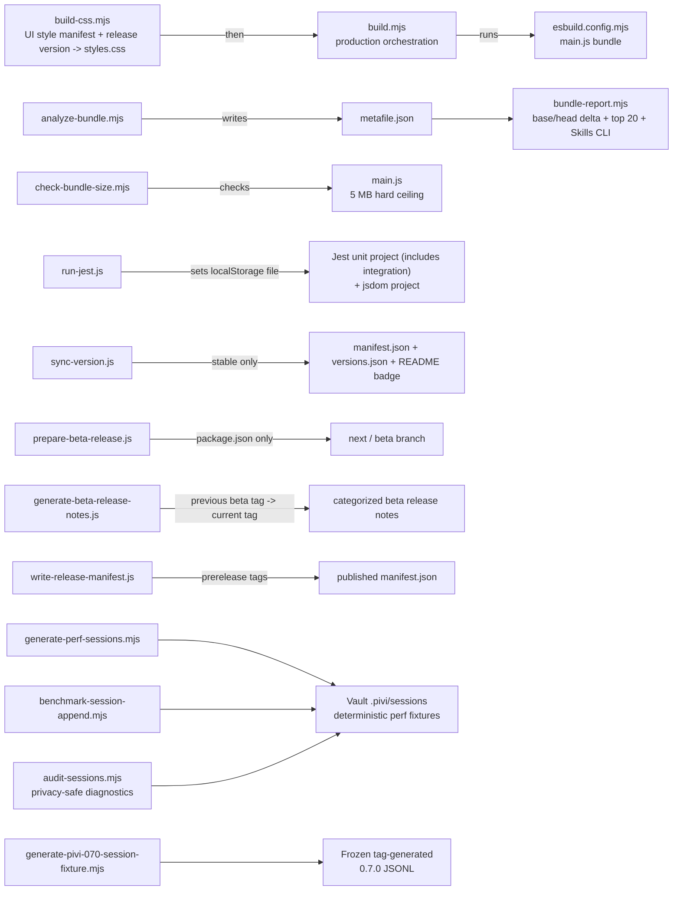

# `scripts/` — Build, test, version, and analysis helpers

*This file extends the root [AGENTS.md](../AGENTS.md). Follow root guidance first, then these local rules.*

Small Node scripts backing `package.json` commands. Keep them single-purpose and runnable with `node scripts/<name>`.

## Build/test flow

## Files

- `build-css.mjs` — Prepends the release-version banner and Obsidian host theme-token mapping, concatenates the ordered `packages/pivi-react/styles/manifest.mjs` modules into root `styles.css`, validates missing/unlisted CSS modules, and rejects `!important` in every host/React CSS input. Production mode minifies while preserving the Style Settings metadata block and selector-significant whitespace before pseudo classes.
- `build.mjs` — Production build orchestrator: CSS first, then esbuild bundle.
- `analyze-bundle.mjs` — Uses the selected checkout's shared `build/create-build-options.mjs` configuration and generates pre-postprocess esbuild metadata without writing a separate bundle. `--project` selects another checkout and `--output` selects the metadata path; PR CI uses both to compare base and head under identical conditions.
- `bundle-report.mjs` — Compares base/head metafiles and emits the PR Markdown summary: total bytes and delta, 20 largest current inputs with per-input deltas, and the exact embedded Skills CLI gzip bytes. Growth above 100 KiB or 2% is a visible review warning, not a failing gate.
- `check-bundle-size.mjs` — Checks a built root `main.js` against the 5 MB hard ceiling. Run after `npm run build` via `npm run check:bundle-size`; relative-growth review belongs to `bundle-report.mjs`, not a stale recorded baseline.
- `run-jest.js` — Required Jest wrapper; supplies the Node `--localstorage-file` backing file expected by tests.
- `sync-version.js` — Syncs **stable** `package.json` versions into `manifest.json`, `versions.json`, and the root README version badge. Skips those files for semver prerelease versions so the community-plugin channel stays on the last stable release.
- `versionMetadata.js` — Shared stable/prerelease version helpers used by the sync and release scripts.
- `prepare-beta-release.js` — Bumps `package.json` on `next` or `beta`, prints commit/tag commands, and never mutates root `manifest.json`. Entry point for `npm run version:beta`.
- `generate-beta-release-notes.js` — Generates categorized beta GitHub release notes from conventional commits between the previous reachable tag and the current prerelease tag. It excludes release-preparation commits and always appends the exact compare link. Stable changelog sections are written by the maintainer in the release commit.
- `write-release-manifest.js` — Writes a release asset `manifest.json` from the stable root template plus `package.json.version`. Used by `release.yaml` for prerelease tags.
- `postinstall.mjs` — Creates `.env.local` from example outside CI when missing.
- `generate-perf-sessions.mjs` — Writes four deterministic, Pi-compatible JSONL sessions (1K messages, 5K messages, one 100KB Markdown response, and 20 completed subagents) under a supplied vault's `.pivi/sessions/`. It only overwrites its fixed `perf-00*-*.jsonl` fixture names. Run with `node scripts/generate-perf-sessions.mjs <vault>`.
- `generate-pivi-070-session-fixture.mjs` — Reproduces the frozen Pivi 0.7.0 session fixture from immutable tag commit `f27ca3be149ecf4497f8d2e6ab8a236d14308c59`. It verifies the tag and exact Pi 0.80.6 lock and installed versions, runs the tag's real `PiSessionStore` writer in a disposable worktree with fixed time/random inputs, rejects machine paths, verifies SHA-256, and writes only the requested output file. Run with `node scripts/generate-pivi-070-session-fixture.mjs <output-jsonl>` from a disposable checkout whose installed Pi dependencies match the tag lock; the normal current install may intentionally fail this provenance guard.
- `benchmark-session-append.mjs` — Compares the former rewrite-after-every-append path with the indexed true-append path on temporary copies of the fixed 5K fixture. It runs five trials of twenty appends per mode and reports per-append medians without modifying the source fixture. Run with `node --import tsx scripts/benchmark-session-append.mjs <vault>`.
- `summarize-projection-traces.mjs` — Validates development `pivi-chat-perf-v2` traces and reports per-trace plus cross-run median/p95/range values for dispatch validation, inclusive dispatch, snapshot construction, entity commit, projection commit, paint, Markdown render, and snapshot allocation proxies. Run with `node scripts/summarize-projection-traces.mjs <trace.json> [...]`.
- `audit-sessions.mjs` — Streams real and `perf-*` session JSONL separately and reports aggregate tool/error counts, Bash policy retries, malformed lines, oversized results/sessions, and message-UI overlay amplification. It never prints user text, tool arguments, or JSONL content and never rewrites sessions. Run with `npm run audit:sessions -- <vault-or-sessions-dir>`; add `--json` for structured output.
- `check-i18n-dead-keys.mjs` — Scans product source (not tests) against `packages/pivi-react/src/i18n/locales/en.json` using literal translation-key references plus known dynamic-prefix families (`settings.tabs.*`, tool-presentation keys, model-readiness labels, settings hotkeys). Fails when unused keys remain; pass `--write` to delete them from every locale catalog. Wired into `npm run check:boundaries`.
- `check-docs-contracts.mjs` — Reads `docs/capabilities.json`, requires its canonical remote-only MCP statement in README, SECURITY, and the MCP handbook, and rejects precise current-feature claims for removed capabilities across active Markdown. It also validates inline/reference/image relative links, URL-encoded paths, and Markdown fragments in root/community docs, handbook/recipes, package docs/guidance, and active specs while ignoring code examples. `CHANGELOG.md` and archived specs are excluded as source history, but active links into archives remain validated. It is wired into `npm run check:boundaries`.
- `check-architecture-boundaries.mjs` — Fails on forbidden imports and capability calls across package seams. Notable rules: `@pivi/agent` must not import `@earendil-works/*`, `@pivi/engine-pi`, `@pivi/obsidian-host`, `@pivi/obsidian-tools`, `@pivi/pivi-react`, or product `@/app` / `@/ui`; `@pivi/engine-pi` must not import `obsidian`, host/tools/react packages, React, or product `@/app` / `@/ui`; `@pivi/pivi-react` must not import product `src/**`, concrete host/tools, `@pivi/engine-pi`, raw Pi SDKs, the aggregate `@pivi/agent` root, the agent runtime barrel, or agent-owned `runtime/chatPorts` (narrow presentation-safe leaves such as `runtime/auxQueryRunner` remain allowed). The React package also owns its DOM/CSS vocabulary: JSX, DOM class operations, and CSS selectors cannot use Obsidian classes such as `setting-item*`, `modal*`, `checkbox-container`, `theme-*`, or `svg-icon`; public presentation-port identifiers and locale keys stay host-neutral; credential/workspace copy uses injected terminology placeholders in every locale. `src/ui/**` must not import raw `@earendil-works/*`, any `@pivi/engine-pi/**`, `@pivi/obsidian-host/**`, `src/app/runtime/**`, `src/app/ui/**` (alias or relative), or React-owned presentation ports, and its AST must contain no `getUiFacades()` / `getPiWorkspace()` / `saveSettings()` / `getAllViews()` capability bypass or named re-export of those symbols. Only `src/app` and `src/main.ts` may import `@pivi/engine-pi`; production composition uses responsibility-scoped `application/{auth,models,oauth,oauth-flows,runtime,session}`, while `src/app` alone may dynamically import `application/development`. Only `src/app/ui` may mount `@pivi/pivi-react` surfaces or import its Settings presentation ports. Only `imperativeChatAdapter.ts` may import or inspect the chat `TabManager` / `TabData` aggregate; other app callers use semantic view handles. The retired React package identity and retired `@pivi/pivi-agent-core` package name are rejected in both `src` and `packages`. `@pivi/obsidian-tools` must not import raw Pi SDKs, `@pivi/engine-pi`, or `@pivi/agent/engine`; `@pivi/obsidian-host` stays host-only (no `@pivi/engine-pi`, agent skills/tools, or concrete tool packages). Chat runtime/application ports are owned by `@pivi/agent/runtime/chatPorts`; `src/app/hostContracts.ts` must not import `@pivi/engine-pi` or app runtime implementation modules; `src/app/runtime/**` must not import `@/ui/**`; `packages/**` must not import `src/**`; `src/main.ts` is the only Obsidian `Plugin` composition root. Every package-source import must be declared by its owning workspace manifest; runtime imports/re-exports cannot rely on `devDependencies`, host runtimes are peers, and built-ins remain declaration-free. Every `@pivi/*` import is validated against the target package's explicit `exports`, each export resolves through its active local npm workspace link, and root TypeScript paths may not expose wildcard internals. Run via `npm run check:architecture` or the combined `npm run check:boundaries`.
- `check-architecture-boundaries.mjs` also rejects `@pivi/agent`-owned `pivi_sessions` factory/recovery-port identifiers under `@pivi/obsidian-tools`.
- `check-package-readmes.mjs` — Fails when any `packages/*/README.md` is missing Purpose / Allowed dependencies / Forbidden dependencies / Public API sections.
- `check-specs.mjs` — Validates tracked spec filenames, continuous permanent IDs, flat frontmatter and real dates, required sections, active/archive lifecycle placement, and exact ascending README index coverage. Wired into `npm run check:boundaries` through `npm run check:specs`.
- `check-pi-pins.mjs` — Fails when `@earendil-works/pi-*` versions are ranged or desynchronized across root/`engine-pi` manifests, the lockfile workspace key `packages/engine-pi`, and `packages/engine-pi/src/shims/piCodingAgentConfig.VERSION`. The agent package is not required to pin Pi packages. Wired into `npm run check:boundaries` through `npm run check:pi-pins`.
- `check-pi-compatibility.mjs` — Validates `packages/engine-pi/compatibility-manifest.json`: required lifecycle fields, exact-pin alignment, unique IDs, existing implementation/test paths, and coverage of the known upstream-shape-dependent compatibility files. Wired into `npm run check:boundaries`.
- `prepare-pi-canary.mjs` — Resolves the newest stable version shared by all three Pi packages and, only in the scheduled workflow's ephemeral checkout, applies that target to both manifests, the config shim, and compatibility inventory before lockfile installation and compatibility tests.
- `smoke-obsidian.mjs` — Development-artifact real-host runner (`npm run smoke:obsidian`). Every renderer operation validates canonical `OBSIDIAN_VAULT`; CLI calls use explicit targeting and a finite timeout. Through a versioned semantic view command it runs a deterministic Pi turn whose registered `write` tool creates one UUID note, reloads, reopens the durable session, compares semantic messages/tool result/note bytes, and retains the original fetch object across both reloads. App-owned cleanup verifies run markers and removes only the session/note through their owners. Safety regressions use `tests/unit/app/realHostSmoke.test.ts`, `tests/unit/scripts/smokeObsidian.test.ts`, and the CLI double; they do not replace designated-vault live evidence.
- `check-helpers.mjs` — Utility functions used by boundary/readme check scripts (e.g. walk directories, parse TS imports).
- `architecture-import-allowlist.json` — Allowlist configuration containing structured import bypass rules for packages/tests.

## Gotchas

- Do not bypass `run-jest.js` for normal test runs; direct Jest may use different localStorage behavior.
- `build-css.mjs` intentionally fails if a CSS file under `packages/pivi-react/styles/` is not listed in its manifest.
- Release workflows upload only `main.js`, `manifest.json`, and `styles.css`. Prerelease tags may keep a stable root `manifest.json` in git while the uploaded manifest matches the tag.
- Production and analysis share the build plugins under `build/`. Pi source imports public session exports from the package root, while the build narrows that entrypoint away from the upstream CLI/TUI graph; nested shrinkwrap packages resolve from the project root only when a root copy exists, and package-import aliases (`#...`) stay with their owning package. Keep `buildCompatibility.test.ts` and a production build green when changing this boundary.
- `build/release-artifact-version.mjs` supplies the package-version banner for both `main.js` and `styles.css`. Keep both release assets version-distinct so a digest cannot inherit ambiguous attestations from an earlier tag.
- Keep architecture/readme/spec checks single-purpose and dependency-light; they are run both directly and from Jest smoke or fixture tests.
- Repository check diagnostics use forward-slash relative paths on every host, and `check-specs.mjs` normalizes CRLF input before parsing so Windows checkout line endings do not change repository validity.
- The 0.7.0 provenance generator must keep its tag commit, exact Pi dependency versions, frozen SHA, fixed synthetic paths, and fixture README record synchronized. Do not replace its tag writer with a hand-authored JSONL serializer or describe its synthetic content as captured user data.
