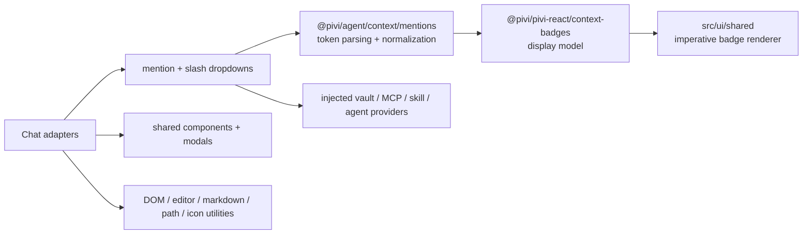

*This file extends the root [AGENTS.md](../../../AGENTS.md). Follow root guidance first, then these local rules.*

# Shared UI

## Purpose

`src/ui/shared/` owns reusable imperative presentation and composer infrastructure used by chat adapters. Keep this layer UI-focused: coordinate mention/slash dropdowns, render context badges, and bridge small Obsidian DOM/editor interactions. Pure mention parsing lives in `@pivi/agent/context/mentions`, slash matching lives under `@pivi/agent/skills`, and context-badge view models remain in the React `context-badges` presentation subpath; product workflow and runtime semantics belong in their owning feature, app, or `@pivi/*` package.

## Architecture

The token text is canonical. Rich composers replace recognized text with non-editable badges carrying the original token in `data-mention-token`; extraction reconstructs the same plain text before submission. Stored messages are parsed again to render equivalent badges.

## Key subdirectories and files

- `src/ui/shared/mention/`: the composer mention system. `MentionDropdownController.ts` coordinates suggestions through callbacks/providers; token recognition uses `@pivi/agent/context/mentions` with a narrow `MentionVaultLookup`; `createMentionVaultLookup` and `obsidianMentionVault` adapt Obsidian metadata/path behavior outside the agent package; `inlineMentionBadgeDom.ts` preserves the text/DOM round trip; `MentionInput.ts` is the reusable contenteditable mention input base (textarea-compatible API, IME-safe badge synchronization) shared by the chat composer (`RichChatInput`) and the settings mention editor port; vault caches and item builders keep file/folder lookup out of controllers; `expandFolderMentions.ts` expands vault folders into context-file paths. `renderMentionBadges.ts` rebuilds badges from parsed tokens for stored/read-only content, `inlineContextNavigation.ts` reveals inline context back in the editor, `mentionTokenHelpers.ts` owns dropdown width measurement, and `types.ts` / `composerInputTypes.ts` own the `MentionItem` union and `ComposerInput` contract.
- `src/ui/shared/context-badge/`: token conversion plus imperative DOM rendering for files, folders, attachments, MCP tools, skills, agents, and inline selections. It consumes the `@pivi/agent` mention parser and React-owned context-badge display model, injecting the shared translator for tooltip and accessibility copy; use it instead of inventing feature-specific chips.
- `src/ui/shared/components/`: generic selectable dropdown; slash command/skill/built-in-tool/MCP catalog with fuzzy matching and stale-request guards; and a lazily installed CodeMirror 6 selection highlight.
- `src/ui/shared/modals/`: promise-based confirmation helpers. Custom slash-command create/edit presentation is React-owned under `packages/pivi-react/src/settings/CommandsTab.tsx`.
- `src/ui/shared/dom.ts`: popout-safe document/window lookup. Resolve globals from the owning element whenever possible.
- `src/ui/shared/selectionToolbar/`: edit-mode selection trigger (`ViewPlugin`), `coordsAtPos` geometry helpers, interaction-state tracking, and imperative floating overlay hosts for the selection toolbar and inline edit surfaces. CM6 extension registration stays in `src/app/editorSelectionToolbarRegistration.ts`.
- `src/ui/shared/utils/`: focused helpers for Obsidian links, editor access, external-context paths and folder picking, MCP/check/chat icons, and animation frames. `obsidianPrivateApi.ts` is the single review point for Obsidian/CodeMirror/browser private-property casts (`containerEl`, CSS Highlight, owner-window `Event`, Editor `.cm`). Provider logos are React-owned under `packages/pivi-react/src/icons/`. Pure streaming-math escaping lives in `@pivi/agent/settings` and `@pivi/agent/runtime`.

## Mention and command flow

- `@` suggestions cover vault files/folders, selected external-context roots, and an `Agents/` submenu. Because the trigger already supplies `@`, workspace folder rows display `path/` without a redundant prefix while insertion retains the canonical `@path/` token. File selection also invokes `onAttachFile`; aliases are inserted as `@[[path|alias]]` only when safe. Agent tokens use `@id (agent)`.
- Parsing only starts `@` or `/` tokens at the beginning of text or after whitespace. It resolves inline-context tokens first, then agents, wikilinks, external roots, and vault paths. Unknown tokens remain plain text.
- File/folder mentions may contain spaces because resolution chooses the longest valid vault lookup match. Preserve punctuation, path normalization, Windows case handling, aliases, and wikilink behavior when changing the parser.
- External-context mentions represent configured root folders only. They resolve display labels to absolute roots at send time and must not recursively enumerate external files. Duplicate root names are disambiguated with one parent segment.
- Vault folder mentions recursively contribute vault-relative paths to `<context_files>`; file content is not read here. Absolute external roots are deliberately excluded from expansion.
- Current canonical MCP syntax is `/server` or `/server/tool`, not an `@` token. Selector labels omit the decorative `/`, while insertion and persistence retain `/server[/tool]`; the detail panel identifies the server. Slash badges still use known context-saving server names for composer highlighting; settings-enabled servers are always available to the agent. Turn finalization in `@pivi/agent` appends ` MCP` to valid slash tokens for the API prompt while persisted text stays unchanged.
- Slash suggestions merge runtime skills, enabled MCP servers/tools, the built-in image tool token, and the injected command catalog. Rows use distinct command, skill, tool, and MCP icons centered against the complete name/description block. All selector labels omit the decorative `/`; the local dropdown model therefore carries only the canonical insertion prefix. `/generate-image` is a `tool` entry only while `obsidian_generate_image` is enabled in Settings > Tools; it never becomes a prompt command, and its API-only transform preserves the token/badge in composer and history. MCP server rows prefer the configured server description and otherwise summarize the discovered non-disabled tool names. Catalog + MCP tool entries share one generation-guarded cache loader; plugin/tab warmup and settings invalidation prefetch enabled HTTP/SSE servers. Stdio MCP is not supported. Stable identities are deduplicated case-insensitively, allowing equal tool short names from different servers; MCP tool discovery uses per-server settled results and remains retryable after partial failure. Hidden commands are filtered; a monotonic request generation invalidates stale work on catalog replacement, cache reset, hide, and destroy; canonical selected text is inserted before callbacks run.

## Patterns and constraints

- Keep dependencies pointing toward host-neutral Pivi contracts (`foundation`, `context`, `skills`, etc.). Never import `@pivi/engine-pi`, raw Pi SDKs, `@pivi/obsidian-host`, or `src/app/runtime/**` here. Use injected structural providers/callbacks; use `src/app/hostPlatform.ts` only for the approved host-platform facade.
- Direct public `obsidian` imports are appropriate for UI primitives (`App`, `Modal`, `Setting`, `TFile`, `TFolder`, `setIcon`) and workspace rendering. Do not move product/runtime composition into these helpers.
- Keep parsers, scoring, normalization, and view-model creation as pure as practical. DOM renderers consume typed tokens/view models and callbacks rather than feature state.
- Preserve the separation between `@pivi/agent` mention token parsing, React context-badge display modeling, and imperative rendering. Add a new mention kind across `@pivi/agent` `mentionTypes.ts`, parser conversion, React `context-badges` contracts/model, and the imperative renderer together.
- Use owner-realm Obsidian helpers plus `ownerDocument` / `getActiveDocument()` and `getActiveWindow()` for created DOM, fragments, selections, timers, and geometry so popout windows work. Avoid raw `document.createElement*`, `document.createDocumentFragment`, and new direct `window`/`document` assumptions.
- Dropdown keyboard handlers return whether they consumed the event. Keep Arrow, Enter/Tab, Escape, focus restoration, scrolling, click propagation, and fixed-versus-anchored positioning behavior consistent.
- Selection-toolbar scroll handling recomputes live geometry when possible and dismisses when the selection is invalid; ordinary toolbar actions restore editor focus unless they intentionally open another durable surface.
- Floating overlays in `selectionToolbar/floatingOverlay.ts` pass Escape to the host only when invisible; visible overlays consume Escape. Attach outside-pointer listeners in the capture phase on the owner document and remove them on hide/dispose.
- Slash and mention dropdowns dismiss on outside `pointerdown`, subscribe to owner scroll to reposition or dismiss, and cancel pending mention debounce timers on hide (not only on destroy).
- Keep slash row descriptions ellipsized within the dropdown and clamp the adjacent detail panel to the remaining width inside its owning sidebar/input container; long unbroken tokens must wrap rather than expand either surface. Stack slash detail below the list on narrow containers instead of clipping off-screen.
- Respect IME composition. Do not accept mentions on composing Enter/Tab or rebuild a rich composer on every keystroke; badge synchronization waits for a completed token/whitespace boundary.
- User-visible copy must use the shared translator from `@/app/i18n`; technical token labels and user content may remain literal. Preserve accessible roles, labels, keyboard removal, and focus/cursor restoration.
- Imperative dropdown DOM consumed by `@pivi/pivi-react` styles uses semantic `pivi-*` classes such as `pivi-mention-item--workspace-folder`; do not expose vault/host terminology or unnamespaced state classes across that presentation seam.
- Product/provider icons must remain bundled/local. Do not add runtime CDN fetches; React provider logos use bundled static SVG masks or package fallbacks.

## Gotchas

- Obsidian extends DOM prototypes (`empty`, `createDiv`, `addClass`, `instanceOf`, and related helpers). Tests and popout documents must provide compatible behavior; do not casually replace `instanceOf` with realm-sensitive `instanceof` for DOM nodes.
- `parseMessageMentions()` is an `@pivi/agent` parser that consumes a supplied `MentionVaultLookup`; it does not scan Obsidian by itself. `createMentionVaultLookup` and stored-message rendering may inspect vault metadata, while interactive suggestions use `VaultMentionDataProvider`. Mark caches dirty on vault changes and retain stale cache data when refresh fails.
- Empty-query vault suggestions prioritize the active file, then recency; alias hydration is deferred until after the first 100 files are selected. Search results cap files at 100 and folders at 50.
- Inline badges are not the source of truth: `data-mention-token` is. Changing a visible label must not mutate submitted text. Inline-context badges are removable; ordinary inline mention badges generally are not.
- Context badges render as `span.pivi-context-badge--inline` only in composer inline mode and as `button` otherwise. Keep the explicit inline class synchronized with the element mode so compact composer metrics apply. Disabled folder/tool badges intentionally do not navigate; file badges require an explicit click callback.
- Streaming math escaping is transient and must skip fenced code, inline code, pre-escaped dollars, and HTML tags. Do not persist the escaped rendering form.
- `processFileLinks()` mutates rendered Markdown after Obsidian rendering, repairs app/Obsidian URIs and embeds, and deliberately skips code blocks/anchors during text-node walks. Register delegated handlers through an Obsidian `Component` for cleanup.
- Folder picking and synchronous filesystem validation are desktop/Electron-only and can throw or block; callers must own user-facing failure handling. External path availability is checked per turn so temporarily unavailable pinned roots are retained.
